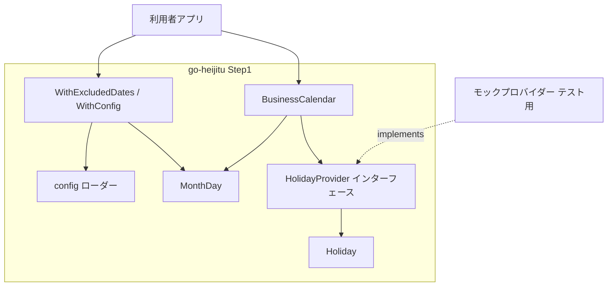
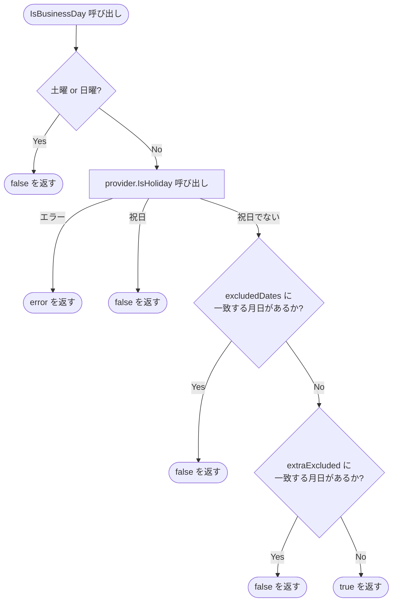
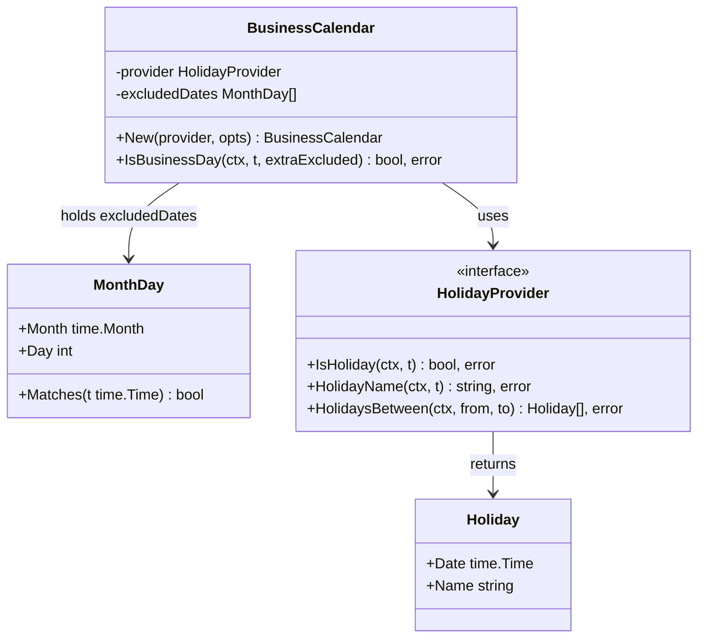

# 設計書: Step 1 — プロジェクト初期化 + コア実装

## Overview

`go-heijitu` は日本の営業日を計算する Go ライブラリである。  
本ステップでは、ライブラリの土台となる型・インターフェース・`BusinessCalendar` 構造体を実装し、`IsBusinessDay()` による営業日判定を動作可能な状態にする。

**Purpose**: 後続ステップで実装されるプロバイダーと残り API がここで定義した型とインターフェースに依存するため、本ステップは全体の基盤となる。  
**Users**: Go ライブラリを利用するアプリケーション開発者が対象。  
**Impact**: 本ステップ完了後、モックプロバイダーを用いて `IsBusinessDay()` の呼び出しが可能になる。

### Goals

- `MonthDay` / `Holiday` / `HolidayProvider` / `BusinessCalendar` の公開型・インターフェースを確立する
- `IsBusinessDay()` の判定ロジック（土日・祝日・除外日付の複合判定）を実装する
- YAML/JSON 設定ファイルから除外日付を読み込む機能を実装する
- 後続ステップがインターフェースを満たすプロバイダーを追加できる拡張点を用意する

### Non-Goals

- 実際の祝日プロバイダー実装（holidayjp / caoCsv / googleCalendar）は対象外
- `IsBusinessDay` 以外の API（`NextBusinessDay` / `FirstBusinessDayOfMonth` / `FirstBusinessDaysOfYear` / `Holidays`）は対象外

---

## Boundary Commitments

### This Spec Owns

- `MonthDay` 型・`Holiday` 型・`config` 型（非公開）の定義
- `HolidayProvider` インターフェースの定義
- `BusinessCalendar` 構造体・`New()` コンストラクタ・`IsBusinessDay()` メソッドの実装
- `WithExcludedDates()` / `WithConfig()` オプション関数の実装
- 設定ファイル（YAML/JSON）の読み込みロジック

### Out of Boundary

- `HolidayProvider` の具体的な実装（Step 2 以降）
- `NextBusinessDay` / `FirstBusinessDayOfMonth` / `FirstBusinessDaysOfYear` / `Holidays` API（Step 2）
- プロバイダー固有の外部ライブラリ（holiday-jp-go / syukujitsu-go など）

### Allowed Dependencies

- Go 標準ライブラリ（`time` / `context` / `encoding/json` / `path/filepath` / `os`）
- `gopkg.in/yaml.v3`（YAML 設定ファイル読み込み）

### Revalidation Triggers

- `HolidayProvider` インターフェースのメソッドシグネチャを変更した場合、Step 2〜4 の全プロバイダー実装を再検証する
- `MonthDay` / `Holiday` の公開フィールドを変更した場合、全ステップのコードに影響する
- `IsBusinessDay()` のシグネチャを変更した場合、Step 2 のテストに影響する

---

## Architecture

### Architecture Pattern & Boundary Map

Functional Options パターン + Provider パターンを採用する。`BusinessCalendar` は `HolidayProvider` インターフェースに依存し、具体的な祝日実装を知らない。



**依存方向（厳守）**:
```
Holiday, MonthDay（値オブジェクト）
  ↑                              ↑
HolidayProvider（インターフェース）  config（内部設定型）
  ↑                              ↑
  └─────────── option.go（WithExcludedDates / WithConfig）
                        ↑
             BusinessCalendar（calendar.go）
```

- `calendar.go` は `HolidayProvider` と `MonthDay`（`excludedDates` 保持）に依存する
- `config` は `MonthDay` にのみ依存し、`HolidayProvider` には依存しない
- 上位レイヤーは下位レイヤーのみを import する。逆方向の import は禁止する

### Technology Stack

| Layer | 選択 | バージョン | 役割 |
|-------|------|-----------|------|
| 言語 | Go | 1.23 | 全実装 |
| YAML パース | `gopkg.in/yaml.v3` | 最新安定版 | 設定ファイル読み込み |
| JSON パース | `encoding/json` | 標準ライブラリ | 設定ファイル読み込み |
| テスト | `testing` | 標準ライブラリ | 単体テスト |

---

## File Structure Plan

### Directory Structure

```
go-heijitu/
├── go.mod                  # module github.com/taku-o/go-heijitu, go 1.23
├── go.sum
├── holiday.go              # Holiday 型定義（公開）
├── monthday.go             # MonthDay 型定義 + Matches() メソッド（公開）
├── provider.go             # HolidayProvider インターフェース定義（公開）
├── calendar.go             # BusinessCalendar 構造体 + New() + IsBusinessDay()（公開）
├── option.go               # Option 型 + WithExcludedDates() + WithConfig()（公開）
├── config.go               # config 型（非公開）+ loadConfig() 関数（非公開）
├── monthday_test.go        # MonthDay.Matches() テスト
├── calendar_test.go        # IsBusinessDay() テスト（モックプロバイダー使用）
└── config_test.go          # loadConfig() テスト
```

**パッケージ宣言**: 全 `.go` ファイルは `package heijitu` を宣言する。

**新規作成ファイルのみ**（既存 Go ファイルなし）。

---

## System Flows

### IsBusinessDay 判定フロー



---

## Requirements Traceability

| 要件 | 概要 | コンポーネント | インターフェース | フロー |
|------|------|--------------|----------------|--------|
| 1.1 | MonthDay 型のフィールド | MonthDay | — | — |
| 1.2 | Matches() が true を返す | MonthDay | `Matches()` | — |
| 1.3 | Matches() が false を返す | MonthDay | `Matches()` | — |
| 1.4 | バリデーションなし・直接比較のみ（2/29 は閏年のみ true） | MonthDay | `Matches()` | — |
| 2.1 | Holiday 型のフィールド | Holiday | — | — |
| 3.1 | HolidayProvider インターフェース定義 | HolidayProvider | `IsHoliday` / `HolidayName` / `HolidaysBetween` | — |
| 3.2 | IsHoliday が true を返す | HolidayProvider | `IsHoliday` | — |
| 3.3 | IsHoliday が false を返す | HolidayProvider | `IsHoliday` | — |
| 3.4 | HolidayName が祝日名を返す | HolidayProvider | `HolidayName` | — |
| 3.5 | HolidayName が空文字を返す（非祝日） | HolidayProvider | `HolidayName` | — |
| 3.6 | HolidaysBetween が両端を含む | HolidayProvider | `HolidaysBetween` | — |
| 3.7 | エラー伝播 | HolidayProvider | 全メソッド | — |
| 3.8 | HolidaysBetween で from > to の場合は空スライス返却 | HolidayProvider | `HolidaysBetween` | — |
| 4.1 | New() コンストラクタ | BusinessCalendar | `New()` | — |
| 4.2 | WithExcludedDates | Option | `WithExcludedDates()` | — |
| 4.3 | WithConfig | Option / config | `WithConfig()` | — |
| 4.4 | 除外日付のマージ | BusinessCalendar | `New()` | — |
| 4.5 | WithConfig エラー | Option | `WithConfig()` | — |
| 5.1 | 土日判定 | BusinessCalendar | `IsBusinessDay()` | IsBusinessDay 判定フロー |
| 5.2 | 祝日判定 | BusinessCalendar | `IsBusinessDay()` | IsBusinessDay 判定フロー |
| 5.3 | 除外日付判定 | BusinessCalendar | `IsBusinessDay()` | IsBusinessDay 判定フロー |
| 5.4 | extraExcluded 判定 | BusinessCalendar | `IsBusinessDay()` | IsBusinessDay 判定フロー |
| 5.5 | 営業日として true を返す | BusinessCalendar | `IsBusinessDay()` | IsBusinessDay 判定フロー |
| 5.6 | エラー伝播 | BusinessCalendar | `IsBusinessDay()` | — |
| 6.1 | YAML パース | config | `loadConfig()` | — |
| 6.2 | JSON パース | config | `loadConfig()` | — |
| 6.3 | excluded_dates 読み込み | config | `loadConfig()` | — |
| 6.4 | 不正拡張子エラー | config | `loadConfig()` | — |
| 6.5 | パースエラー | config | `loadConfig()` | — |

---

## Components and Interfaces

### コンポーネント一覧

| コンポーネント | ファイル | 責務 | 要件カバレッジ | 依存（P0/P1） |
|--------------|---------|------|--------------|--------------|
| MonthDay | monthday.go | 月日値オブジェクト + 一致判定 | 1.1, 1.2, 1.3, 1.4 | — |
| Holiday | holiday.go | 祝日値オブジェクト | 2.1 | — |
| HolidayProvider | provider.go | 祝日判定インターフェース | 3.1, 3.6, 3.7, 3.8（3.2–3.5 はモック経由でテスト実証） | Holiday (P0) |
| BusinessCalendar | calendar.go | 営業日判定ロジック | 4.1, 4.4, 5.1–5.6 | HolidayProvider (P0), MonthDay (P0) |
| Option functions | option.go | カレンダー構築オプション | 4.2, 4.3, 4.5 | config (P0), MonthDay (P0) |
| config | config.go | 設定ファイル読み込み | 6.1–6.5 | gopkg.in/yaml.v3 (P1) |
| isExcluded（非公開） | calendar.go | 除外日付チェックの共通ヘルパー | 5.3, 5.4 | MonthDay (P0) |

---

### 値オブジェクト層

#### MonthDay

| Field | Detail |
|-------|--------|
| Intent | 年をまたいで有効な月日を表す値オブジェクト |
| Requirements | 1.1, 1.2, 1.3 |

**Contracts**: Service [x]

##### Service Interface

```go
type MonthDay struct {
    Month time.Month
    Day   int
}

// Matches は t の月と日が MonthDay と一致する場合 true を返す（年は無視）
func (md MonthDay) Matches(t time.Time) bool
```

- 事前条件: なし（フィールド値のバリデーションは行わない）
- 事後条件: `t.Month() == md.Month && t.Day() == md.Day` のとき `true` を返す
- `MonthDay{Month: time.February, Day: 29}` は閏年の 2/29 のみ `true`。平年では `t.Day()` が 29 にならないため自然に `false` となる
- 月が 13 以上・日が 32 以上など存在しない値を設定した場合、いかなる `time.Time` にも一致しないため常に `false` を返す

---

#### Holiday

| Field | Detail |
|-------|--------|
| Intent | 祝日の日付と名称を保持する値オブジェクト |
| Requirements | 2.1 |

```go
type Holiday struct {
    Date time.Time // 祝日の日付
    Name string    // 祝日名（例: "元日"）
}
```

---

### インターフェース層

#### HolidayProvider

| Field | Detail |
|-------|--------|
| Intent | 祝日判定の実装を差し替え可能にするインターフェース |
| Requirements | 3.1–3.6 |

**Contracts**: Service [x]

##### Service Interface

```go
type HolidayProvider interface {
    // IsHoliday は t が祝日であれば true を返す
    IsHoliday(ctx context.Context, t time.Time) (bool, error)

    // HolidayName は t の祝日名を返す。祝日であれば非空文字列、祝日でなければ空文字を返す
    HolidayName(ctx context.Context, t time.Time) (string, error)

    // HolidaysBetween は from から to の間（両端を含む）の祝日リストを返す。from > to の場合は空スライスと nil error を返す
    HolidaysBetween(ctx context.Context, from, to time.Time) ([]Holiday, error)
}
```

- エラー発生時は即座に呼び出し元へ伝播する。内部で握りつぶさない（プロジェクトルール）

---

### ビジネスロジック層

#### BusinessCalendar

| Field | Detail |
|-------|--------|
| Intent | 営業日判定のメイン構造体 |
| Requirements | 4.1, 4.4, 5.1–5.6 |

**Contracts**: Service [x]

##### Service Interface

```go
type BusinessCalendar struct {
    provider      HolidayProvider
    excludedDates []MonthDay // WithExcludedDates / WithConfig で設定した除外日付
}

// New は BusinessCalendar を構築する
func New(provider HolidayProvider, opts ...Option) *BusinessCalendar

// IsBusinessDay は t が営業日かどうかを返す
// extraExcluded はこの呼び出し限りの追加除外日付
func (bc *BusinessCalendar) IsBusinessDay(
    ctx context.Context,
    t time.Time,
    extraExcluded ...MonthDay,
) (bool, error)
```

**IsBusinessDay の判定順序（5.1〜5.5 の優先順位）:**

1. 土曜・日曜 → `false`
2. `provider.IsHoliday(ctx, t)` が `true` → `false`（エラーは即伝播）
3. `bc.excludedDates` に一致する月日あり → `false`
4. `extraExcluded` に一致する月日あり → `false`
5. 上記いずれにも該当しない → `true`

**実装メモ**:
- 除外日付チェック（3・4）は内部ヘルパー `isExcluded(t time.Time, dates []MonthDay) bool` で共通化する
- `isExcluded` は非公開関数

---

### オプション層

#### Option / WithExcludedDates / WithConfig

| Field | Detail |
|-------|--------|
| Intent | BusinessCalendar の構築オプションを提供する |
| Requirements | 4.2, 4.3, 4.5 |

**Contracts**: Service [x]

##### Service Interface

```go
type Option func(*BusinessCalendar)

// WithExcludedDates はパラメータとして除外日付を登録する
func WithExcludedDates(dates []MonthDay) Option

// WithConfig は設定ファイルから除外日付を読み込むオプションを返す
// ファイルの読み込み・パースに失敗した場合はエラーを返す
func WithConfig(configPath string) (Option, error)
```

- `WithExcludedDates` と `WithConfig` は併用可能。`New()` に渡された順に `excludedDates` へ追記する（マージ）
- `WithConfig` はファイル読み込みを `New()` 呼び出し前に行い、エラーを即返す（Requirement 4.5）

---

### 設定ファイル層

#### config（非公開）

| Field | Detail |
|-------|--------|
| Intent | YAML/JSON 設定ファイルを読み込む非公開コンポーネント |
| Requirements | 6.1–6.5 |

**Contracts**: Service [x]

```go
type config struct {
    ExcludedDates []MonthDay `yaml:"excluded_dates" json:"excluded_dates"`
}

// loadConfig はパスの拡張子から形式を判別してパースする
// 対応拡張子: .yaml / .yml（YAML）、.json（JSON）
// それ以外の拡張子はエラーを返す
func loadConfig(path string) (*config, error)
```

- `filepath.Ext()` で拡張子を判別する
- YAML: `gopkg.in/yaml.v3` の `yaml.NewDecoder` を使用
- JSON: `encoding/json` の `json.NewDecoder` を使用
- ファイルが存在しない・読み取れない・パース失敗のいずれもエラーを返す（握りつぶさない）

---

## Data Models

### Domain Model



---

## Error Handling

### Error Strategy

プロジェクトルール: **エラーは即座に呼び出し元へ伝播する。フォールバックなし。**

| 発生箇所 | エラー原因 | 対応 |
|---------|-----------|------|
| `WithConfig()` | ファイルが存在しない | `os.ErrNotExist` を wrap して返す |
| `WithConfig()` | ファイルの読み取り失敗 | OS エラーをそのまま返す |
| `WithConfig()` | YAML/JSON パース失敗 | デコーダーのエラーをそのまま返す |
| `WithConfig()` | 対応外の拡張子 | 独自エラーメッセージを返す |
| `IsBusinessDay()` | プロバイダーがエラー返却 | エラーをそのまま呼び出し元へ伝播 |

`error` の独自型は Step 1 では定義しない。標準 `errors.New` / `fmt.Errorf` を使用する。

---

## Testing Strategy

### Unit Tests

| テスト対象 | 検証内容 | ファイル |
|----------|---------|---------|
| `MonthDay.Matches()` | 一致する月日で `true`、不一致で `false`、年が異なっても一致判定 | monthday_test.go |
| `loadConfig()` YAML | YAML ファイルから `excluded_dates` を正しく読み込む | config_test.go |
| `loadConfig()` JSON | JSON ファイルから `excluded_dates` を正しく読み込む | config_test.go |
| `loadConfig()` 不正拡張子 | エラーを返すこと | config_test.go |
| `loadConfig()` 不正コンテンツ | パースエラーを返すこと | config_test.go |
| `IsBusinessDay()` 土日 | 土曜・日曜で `false` | calendar_test.go |
| `IsBusinessDay()` 祝日 | モックが `true` を返す日付で `false` | calendar_test.go |
| `IsBusinessDay()` 除外日付 | `WithExcludedDates` / `WithConfig` で登録した日付で `false` | calendar_test.go |
| `IsBusinessDay()` extraExcluded | 引数で渡した月日にのみ適用され、他の呼び出しに影響しない | calendar_test.go |
| `IsBusinessDay()` 通常営業日 | 平日・非祝日・除外日付なしで `true` | calendar_test.go |
| `IsBusinessDay()` エラー伝播 | モックがエラーを返したとき `IsBusinessDay` もエラーを返す | calendar_test.go |
| `WithExcludedDates` + `WithConfig` マージ | 両方の除外日付が有効になること | calendar_test.go |

**テスト用モックプロバイダー**: `calendar_test.go` 内にローカル定義する。本番利用を目的としない。

```go
// calendar_test.go 内ローカル定義
type mockProvider struct {
    holidays map[string]string // "2006-01-02" → 祝日名
}
func (m *mockProvider) IsHoliday(ctx context.Context, t time.Time) (bool, error) { ... }
func (m *mockProvider) HolidayName(ctx context.Context, t time.Time) (string, error) { ... }
func (m *mockProvider) HolidaysBetween(ctx context.Context, from, to time.Time) ([]Holiday, error) { ... }
```
