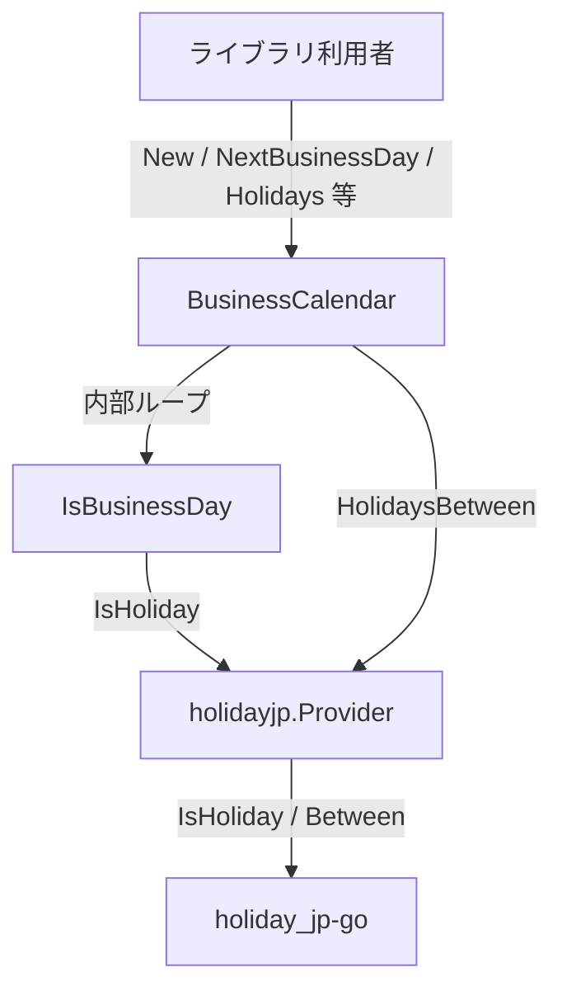
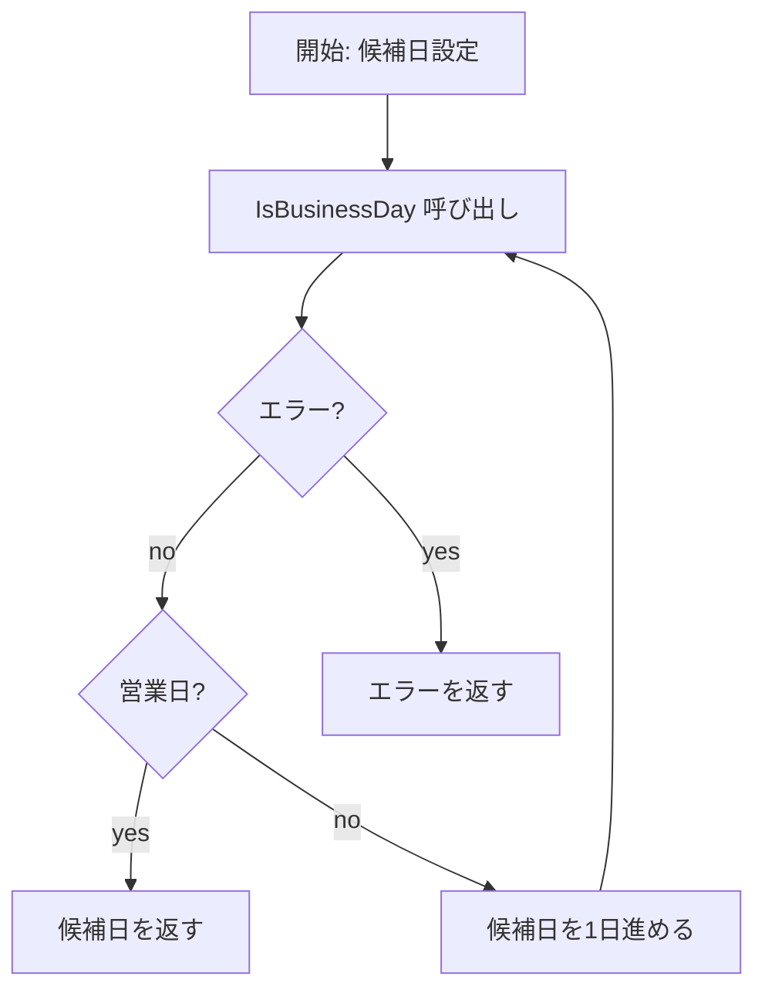

# 設計書: Step 2 — holidayjp プロバイダー + 残りAPI実装

## Overview

`go-heijitu` に日本の国民祝日をデータ埋め込みで判定する `holidayjp` プロバイダーを追加し、Step 1 で骨格のみ用意した `BusinessCalendar` の残り4つの公開 API を実装する。

本ステップ完了後、`holidayjp.New()` を渡すだけですべての `BusinessCalendar` API が動作する状態になる。I/O 不要・依存最小の構成を維持し、Step 1 の設計パターンを踏襲する。

### Goals
- `github.com/holiday-jp/holiday_jp-go` をラップする `providers/holidayjp` パッケージの提供
- `NextBusinessDay`・`FirstBusinessDayOfMonth`・`FirstBusinessDaysOfYear`・`Holidays` の実装
- Step 1 のテストパターン（テーブル駆動・ブラックボックス）を踏襲したテストの提供

### Non-Goals
- `caoCsv` / `googleCalendar` プロバイダーの実装
- Step 1 の既存 API・型・インターフェースの変更
- `NextBusinessDay` における検索上限日数の定義（要件定義外）

## Boundary Commitments

### This Spec Owns
- `providers/holidayjp/` パッケージ（新規）: `HolidayProvider` インターフェースを実装する `Provider` 型と `New()` ファクトリ
- `calendar.go` への4メソッド追加: `NextBusinessDay`・`FirstBusinessDayOfMonth`・`FirstBusinessDaysOfYear`・`Holidays`
- 上記に対応するテストコード（`providers/holidayjp/provider_test.go`・`calendar_test.go` への追記）

### Out of Boundary
- `HolidayProvider` インターフェース定義（Step 1 所有、変更しない）
- `IsBusinessDay`・`isExcluded` の変更（既存実装をそのまま内部利用するのみ）
- `caoCsv` / `googleCalendar` プロバイダーの任意のコード

### Allowed Dependencies
- `github.com/taku-o/go-heijitu`（ルートパッケージ）— `HolidayProvider` インターフェース・`Holiday` 型
- `github.com/holiday-jp/holiday_jp-go`（新規追加）— 埋め込み祝日データ

### Revalidation Triggers
- `HolidayProvider` インターフェースのシグネチャ変更（Step 1 が変更した場合）
- `Holiday` 型のフィールド変更
- `IsBusinessDay` の営業日判定ロジック変更（`NextBusinessDay` / `FirstBusinessDayOfMonth` が依存しているため）

## Architecture

### Architecture Pattern & Boundary Map



選択パターン: **Adapter（thin wrapper）** + **Extension（既存 calendar.go へのメソッド追加）**

- `holidayjp.Provider` は `holiday_jp-go` の API を `HolidayProvider` インターフェースに変換するゼロ値アダプター
- 新規 `BusinessCalendar` メソッドは既存の `IsBusinessDay()` を内部で再利用し、土日・祝日・除外日付の判定ロジックを重複させない

### Technology Stack

| レイヤー | 選択 | 役割 | 備考 |
|---------|------|------|------|
| 祝日データ | `github.com/holiday-jp/holiday_jp-go` | 日本の国民祝日を埋め込みデータで提供 | ネットワーク不要・`go get` で追加 |
| コア言語 | Go 1.23（既存） | ライブラリ実装 | 変更なし |

## File Structure Plan

### Directory Structure

```
（ルートパッケージ: github.com/taku-o/go-heijitu）
calendar.go                      ← 既存: NextBusinessDay / FirstBusinessDayOfMonth /
                                     FirstBusinessDaysOfYear / Holidays を追加
calendar_test.go                  ← 既存: 上記4 API のテストケースを追記
providers/
└── holidayjp/
    ├── provider.go               ← 新規: Provider 型・New()・HolidayProvider 実装
    └── provider_test.go          ← 新規: IsHoliday / HolidayName / HolidaysBetween テスト
go.mod                            ← 既存: holiday_jp-go 依存を追加
go.sum                            ← 自動更新
```

### Modified Files

- `calendar.go` — `NextBusinessDay` / `FirstBusinessDayOfMonth` / `FirstBusinessDaysOfYear` / `Holidays` の4メソッドを追加。`isExcluded()` と `IsBusinessDay()` は既存のまま使用
- `calendar_test.go` — 新規4 API のテストケースを `heijitu_test` パッケージに追記。既存テストは変更しない
- `go.mod` — `require github.com/holiday-jp/holiday_jp-go` を追加

## System Flows

### NextBusinessDay・FirstBusinessDayOfMonth 検索フロー



- `NextBusinessDay` の初期候補日: `from.AddDate(0,0,1)`（from 当日を含まない）
- `FirstBusinessDayOfMonth` の初期候補日: 指定年月の1日。検索は月内に限定する

## Requirements Traceability

| 要件 | 概要 | コンポーネント | インターフェース | フロー |
|------|------|--------------|----------------|------|
| 1.1 | holidayjp.New() でプロバイダー生成 | holidayjp.Provider | New() | — |
| 1.2 | IsHoliday: 祝日 → true | holidayjp.Provider | IsHoliday() | — |
| 1.3 | IsHoliday: 非祝日 → false | holidayjp.Provider | IsHoliday() | — |
| 1.4 | HolidayName: 祝日 → 祝日名 | holidayjp.Provider | HolidayName() | — |
| 1.5 | HolidayName: 非祝日 → 空文字 | holidayjp.Provider | HolidayName() + エラー変換 | — |
| 1.6 | HolidaysBetween: 両端を含む | holidayjp.Provider | HolidaysBetween() | — |
| 1.7 | 外部接続不要 | holidayjp.Provider | — | — |
| 2.1 | NextBusinessDay: from を含まない | BusinessCalendar | NextBusinessDay() | 検索フロー |
| 2.2 | NextBusinessDay: 土日をスキップ | BusinessCalendar | NextBusinessDay() → IsBusinessDay() | 検索フロー |
| 2.3 | NextBusinessDay: 祝日をスキップ | BusinessCalendar | NextBusinessDay() → IsBusinessDay() | 検索フロー |
| 2.4 | NextBusinessDay: 除外日付をスキップ | BusinessCalendar | NextBusinessDay() → IsBusinessDay() | 検索フロー |
| 2.5 | NextBusinessDay: エラー伝播 | BusinessCalendar | NextBusinessDay() | — |
| 3.1 | FirstBusinessDayOfMonth: 最初の営業日 | BusinessCalendar | FirstBusinessDayOfMonth() | 検索フロー |
| 3.2 | 1日が非営業日なら翌日以降を探索 | BusinessCalendar | FirstBusinessDayOfMonth() | 検索フロー |
| 3.3 | FirstBusinessDayOfMonth: エラー伝播 | BusinessCalendar | FirstBusinessDayOfMonth() | — |
| 4.1 | FirstBusinessDaysOfYear: 12件・index=月-1 | BusinessCalendar | FirstBusinessDaysOfYear() | — |
| 4.2 | 各要素 = FirstBusinessDayOfMonth の結果 | BusinessCalendar | FirstBusinessDaysOfYear() | — |
| 4.3 | FirstBusinessDaysOfYear: エラー伝播 | BusinessCalendar | FirstBusinessDaysOfYear() | — |
| 5.1 | Holidays: プロバイダーの結果を返す | BusinessCalendar | Holidays() | — |
| 5.2 | Holidays: 会社除外日付を含まない | BusinessCalendar | Holidays()（委譲のみ） | — |
| 5.3 | Holidays: エラー伝播 | BusinessCalendar | Holidays() | — |

## Components and Interfaces

### コンポーネント一覧

| コンポーネント | パッケージ | 役割 | 要件カバレッジ | 主要依存 | コントラクト |
|--------------|----------|------|-------------|---------|------------|
| holidayjp.Provider | providers/holidayjp | holiday_jp-go を HolidayProvider に変換するアダプター | 1.1–1.7 | holiday_jp-go (P0) | Service |
| BusinessCalendar（新規メソッド） | heijitu（ルート） | NextBusinessDay / FirstBusinessDayOfMonth / FirstBusinessDaysOfYear / Holidays | 2.1–5.3 | HolidayProvider (P0), IsBusinessDay (P0) | Service |

---

### providers/holidayjp

#### holidayjp.Provider

| フィールド | 詳細 |
|---------|------|
| Intent | `holiday_jp-go` の関数を `HolidayProvider` インターフェースにブリッジするゼロ値アダプター |
| Requirements | 1.1, 1.2, 1.3, 1.4, 1.5, 1.6, 1.7 |

**Responsibilities & Constraints**
- `holiday_jp-go` のパッケージレベル関数をラップして `HolidayProvider` 契約を満たす
- 状態を持たない（フィールドなし）
- `HolidayName` の「非祝日エラー」を `("", nil)` に変換する責務を持つ
- `HolidaysBetween` は `holiday.Between(from, to)` の戻り値（`map[string]string` 相当）を `[]heijitu.Holiday` に変換し、日付昇順にソートして返す

**Dependencies**
- External: `github.com/holiday-jp/holiday_jp-go` — 日本の国民祝日データ (P0)
- Inbound: `heijitu.Holiday` 型 — `HolidaysBetween` の戻り値に使用 (P0)

**Contracts**: Service [x]

##### Service Interface

```go
package holidayjp

// New は holidayjp プロバイダーを返す。引数不要・外部接続不要。
func New() *Provider

// IsHoliday は指定日が日本の国民祝日かどうかを返す。エラーは常に nil。
func (p *Provider) IsHoliday(ctx context.Context, t time.Time) (bool, error)

// HolidayName は指定日の祝日名を返す。非祝日の場合は ("", nil) を返す。
func (p *Provider) HolidayName(ctx context.Context, t time.Time) (string, error)

// HolidaysBetween は from〜to（両端含む）の祝日リストを日付昇順で返す。エラーは常に nil。
func (p *Provider) HolidaysBetween(ctx context.Context, from, to time.Time) ([]heijitu.Holiday, error)
```

**Implementation Notes**
- `IsHoliday`: `holiday.IsHoliday(t)` は `bool` のみ返すため、常に `nil` error を付与して返す
- `HolidayName`: `holiday.HolidayName(t)` がエラーを返した場合（非祝日を意味する）は `("", nil)` に変換する。`holiday_jp-go` は I/O を持たない埋め込みデータライブラリなのでエラーは「非祝日」の意味のみであり、変換は安全
- `HolidaysBetween`: `holiday.Between(from, to)` の戻り値（`map[string]string`、キー: "2006-01-02"、値: 祝日名）を `[]heijitu.Holiday` に変換する。日付文字列のパースには `from` の `Location` を使用し、日付昇順にソートして返す

---

### BusinessCalendar（新規メソッド）

#### NextBusinessDay

| フィールド | 詳細 |
|---------|------|
| Intent | `from` の翌日から始まるループで `IsBusinessDay` を呼び出し、最初に true を返した日付を返す |
| Requirements | 2.1, 2.2, 2.3, 2.4, 2.5 |

**Responsibilities & Constraints**
- ループの開始点は `from.AddDate(0,0,1)`（from 当日を含まない）
- 各候補日に `bc.IsBusinessDay(ctx, candidate)` を呼び出す。これにより土日・祝日・除外日付の全チェックが一元化される
- `IsBusinessDay` がエラーを返した場合は即座にエラーを返す

##### Service Interface

```go
func (bc *BusinessCalendar) NextBusinessDay(ctx context.Context, from time.Time) (time.Time, error)
```

- Preconditions: `from` は任意の `time.Time`
- Postconditions: 返り値は `from` より後の日付であり `IsBusinessDay` が true を返す

---

#### FirstBusinessDayOfMonth

| フィールド | 詳細 |
|---------|------|
| Intent | 指定年月の1日から始まるループで `IsBusinessDay` を呼び出し、最初に true を返した日付を返す |
| Requirements | 3.1, 3.2, 3.3 |

**Responsibilities & Constraints**
- ループの開始点は指定年月の1日
- 検索範囲は指定月内のみ（候補日の月が指定月と異なった時点でループ終了）
- 月内に営業日が見つからない場合の挙動は未定義（実運用では発生しない）

##### Service Interface

```go
func (bc *BusinessCalendar) FirstBusinessDayOfMonth(ctx context.Context, year int, month time.Month) (time.Time, error)
```

- Preconditions: `year`・`month` は有効な年月
- Postconditions: 返り値は指定年月内の最初の営業日

**Implementation Notes**
- 候補日は `time.Date(year, month, day, 0, 0, 0, 0, time.Local)` で構築する

---

#### FirstBusinessDaysOfYear

| フィールド | 詳細 |
|---------|------|
| Intent | 1月〜12月の順に `FirstBusinessDayOfMonth` を呼び出し、12要素のスライスを返す |
| Requirements | 4.1, 4.2, 4.3 |

**Responsibilities & Constraints**
- 12回のループで `FirstBusinessDayOfMonth` を呼び出す
- いずれかの月でエラーが返った場合は即座にそのエラーを返す
- 戻り値スライスは `index 0 = 1月、index 11 = 12月` の順序を保証する

##### Service Interface

```go
func (bc *BusinessCalendar) FirstBusinessDaysOfYear(ctx context.Context, year int) ([]time.Time, error)
```

- Postconditions: 返り値スライスの長さは必ず 12

---

#### Holidays

| フィールド | 詳細 |
|---------|------|
| Intent | `bc.provider.HolidaysBetween(ctx, from, to)` に委譲し、プロバイダーの祝日リストをそのまま返す |
| Requirements | 5.1, 5.2, 5.3 |

**Responsibilities & Constraints**
- `WithExcludedDates` / `WithConfig` の会社独自除外日付は含めない（プロバイダーに問い合わせるだけなので自然に満たされる）
- `from > to` の場合の挙動はプロバイダー実装に委ねる（holidayjp では空スライスを返す）

##### Service Interface

```go
func (bc *BusinessCalendar) Holidays(ctx context.Context, from, to time.Time) ([]Holiday, error)
```

- Postconditions: 返り値はプロバイダーが認識する from〜to 間の祝日リスト（両端含む）

---

## Error Handling

### Error Strategy

全 API はエラーを握りつぶさず呼び出し元に即座に伝播する（Fail Fast）。

| エラー源 | 処理 |
|---------|------|
| `HolidayProvider.IsHoliday` エラー | `NextBusinessDay` / `FirstBusinessDayOfMonth` / `FirstBusinessDaysOfYear` が即座に返す |
| `HolidayProvider.HolidaysBetween` エラー | `Holidays` が即座に返す |
| `holiday_jp-go HolidayName` の非祝日エラー | `("", nil)` に変換（I/O なしライブラリのため「非祝日」の意味のみ） |

`holidayjp.Provider` の `IsHoliday` と `HolidaysBetween` は、`holiday_jp-go` が埋め込みデータのみを使うため常に `nil` error を返す。

## Testing Strategy

### Unit Tests（`providers/holidayjp/provider_test.go`）

1. `IsHoliday`: 既知の祝日日付（例: 2025-01-01 元日）で `true`
2. `IsHoliday`: 祝日でない平日で `false`
3. `HolidayName`: 既知の祝日日付で祝日名が返る
4. `HolidayName`: 祝日でない日付で空文字が返る（エラーなし）
5. `HolidaysBetween`: 祝日を含む期間で正しい件数が返る（両端を含む）、かつ日付昇順で並んでいること
6. `HolidaysBetween`: `from > to` で空スライスが返る

### Integration Tests（`calendar_test.go` 追記）

1. `NextBusinessDay`: 金曜日を渡すと翌月曜日が返る（週末スキップ）
2. `NextBusinessDay`: 祝日前日を渡すと祝日の翌営業日が返る（祝日スキップ）
3. `NextBusinessDay`: プロバイダーエラーが伝播する
4. `NextBusinessDay`: `WithExcludedDates` で登録した除外日付をスキップする
5. `FirstBusinessDayOfMonth`: 月初が祝日（例: 1月元日）の場合に翌営業日が返る
6. `FirstBusinessDayOfMonth`: プロバイダーエラーが伝播する
7. `FirstBusinessDaysOfYear`: 12件返る
8. `FirstBusinessDaysOfYear`: プロバイダーエラーが伝播する
9. `Holidays`: 指定期間の祝日リストが正しい件数で返る
10. `Holidays`: プロバイダーエラーが伝播する
