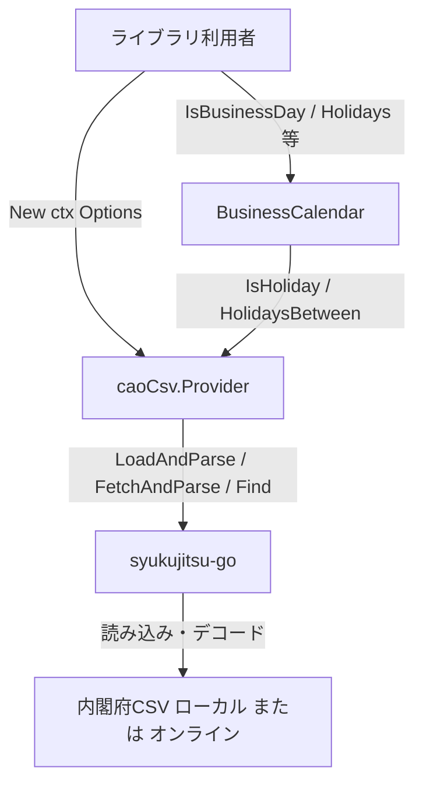
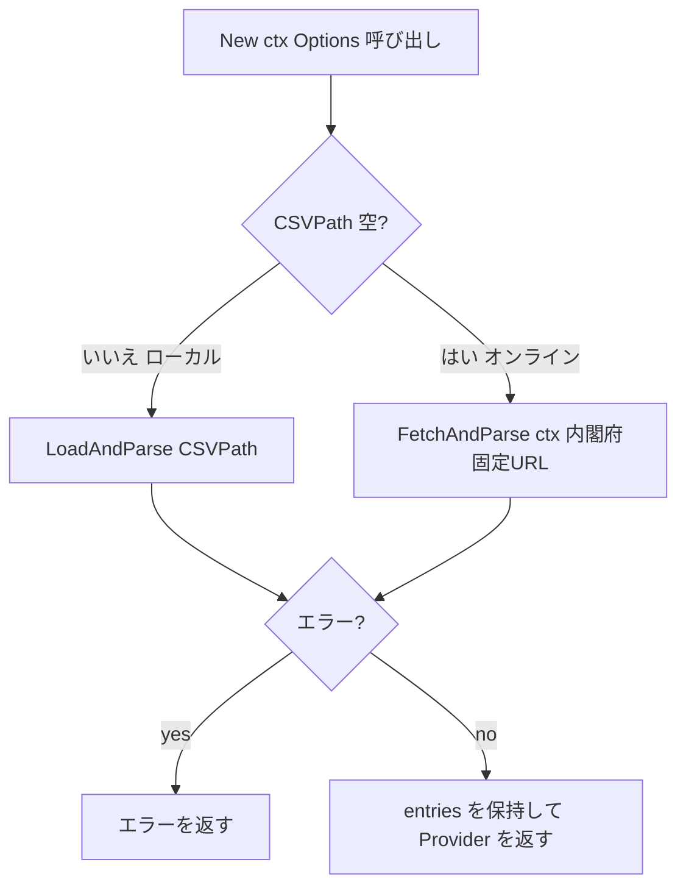

# 設計書: Step 3 — caoCsv（内閣府CSV）プロバイダー実装

## Overview

`go-heijitu` に、内閣府が公開する公式祝日CSV（`syukujitsu.csv`）を祝日データソースとする `caoCsv` プロバイダーを追加する。`HolidayProvider` インターフェースを実装し、既存の `BusinessCalendar` にそのまま渡して全 API を利用できる。

データ取得・Shift_JIS デコード・CSVパースは `github.com/mikan/syukujitsu-go` に全面委譲する。`Options.CSVPath` でデータソースを切り替え、指定時はローカルファイル（`LoadAndParse`）、空時は内閣府公式データのオンライン取得（`FetchAndParse`）を行う。点照合（`IsHoliday` / `HolidayName`）は mikan の `Find` に委譲し、`HolidaysBetween` のみ範囲APIが無いため自前で実装する。holidayjp プロバイダーで確立したアダプター実装パターンを踏襲する。

### Goals
- `github.com/mikan/syukujitsu-go` をラップする `providers/caoCsv` パッケージ（`Provider`・`Options`・`New`）の提供
- ローカルCSVモードとオンライン取得モードの2モード対応
- `IsHoliday` / `HolidayName`（`Find` 委譲）・`HolidaysBetween`（自前）の実装
- ローカルモードのユニットテストと、オンラインモードの `//go:build integration` テストの提供

### Non-Goals
- `googleCalendar` プロバイダーの実装
- コア（`BusinessCalendar`・型・`HolidayProvider` インターフェース・設定ファイル読み込み）および `holidayjp` プロバイダーの変更
- 内閣府公式データソース以外の任意URLからの取得
- 取得済みCSVの永続キャッシュ機構

### 前提条件
- 対象は日本の国民祝日であり、サマータイム（DST）のあるタイムゾーンは考慮しない。日付突合は壁時計の暦日（Y/M/D）で行う（日本時間・`time.UTC` 等を想定）
- 内閣府CSVは Shift_JIS・先頭ヘッダ行あり・`YYYY/M/D, 祝日名` の2列。デコードとヘッダ除外は mikan が内部で処理する

## Boundary Commitments

### This Spec Owns
- `providers/caoCsv/` パッケージ（新規）: `HolidayProvider` を実装する `Provider` 型・`Options` 型・`New()` ファクトリ
- 上記に対応するテストコードとテストデータ（`provider_test.go`・`provider_integration_test.go`・`testdata/syukujitsu_test.csv`）
- `go.mod` への `github.com/mikan/syukujitsu-go` 依存追加

### Out of Boundary
- `HolidayProvider` インターフェース定義・`Holiday` 型（Step 1 所有、変更しない）
- `BusinessCalendar`・`IsBusinessDay`・設定ファイル読み込み（変更しない。既存実装を利用者側が呼び出すのみ）
- `holidayjp` / `googleCalendar` プロバイダーの任意のコード
- 任意URL取得・永続キャッシュ（明示的にスコープ外）

### Allowed Dependencies
- `github.com/taku-o/go-heijitu`（ルートパッケージ）— `HolidayProvider` インターフェース・`Holiday` 型
- `github.com/mikan/syukujitsu-go`（新規追加）— 内閣府CSVの取得・Shift_JISデコード・パース・`Find`
- 標準ライブラリ `context` / `time` / `slices`

### Revalidation Triggers
- `HolidayProvider` インターフェースのシグネチャ変更（Step 1 が変更した場合）
- `Holiday` 型のフィールド変更
- `mikan/syukujitsu-go` の公開API（`LoadAndParse` / `FetchAndParse` / `Find` / `Entry`）の変更

## Architecture

### Existing Architecture Analysis
- 既存の `providers/holidayjp` が「`providers/<name>/` パッケージ + `Provider` 型 + `New()` + `HolidayProvider` 3メソッド実装 + `var _ heijitu.HolidayProvider` のコンパイル時充足チェック」というプロバイダー実装テンプレートを確立済み。caoCsv はこれを踏襲する。
- holidayjp との差分: `New` が I/O（ファイル/HTTP）とエラーを伴う点（`New(ctx, Options) (*Provider, error)`）と、状態（`entries`）を保持する点。

### Architecture Pattern & Boundary Map



選択パターン: **Adapter（thin wrapper）** + **構築時ロード（eager load）**

- `caoCsv.Provider` は mikan の `[]Entry` と `Find` を `HolidayProvider` インターフェースに変換するアダプター
- `New` 時にデータを読み込み・パースして `entries` に確定させ、以降のメソッド呼び出しで追加の I/O を発生させない（要件 1.4 / 3.3）
- 点照合は `Find` に委譲し、独自の日付突合ロジックを持たない。`Find` は壁時計 Y/M/D で突合するため、前提条件の正規化方針と一致する

### Technology Stack

| レイヤー | 選択 | 役割 | 備考 |
|---------|------|------|------|
| 祝日データ取得・パース | `github.com/mikan/syukujitsu-go` | 内閣府CSVの取得（`LoadAndParse`/`FetchAndParse`）・Shift_JISデコード・パース・`Find` | go 1.16 module・`go get` で追加 |
| Shift_JISデコード | `golang.org/x/text v0.3.6` | mikan 経由の推移的依存 | 直接 import しない |
| コア言語 | Go 1.23.4（既存） | ライブラリ実装 | 変更なし |

### モジュール構成の決定

`providers/caoCsv/` は root go.mod と同一モジュールに含める（sub-module 分割なし）。holidayjp と同じく、`go get github.com/taku-o/go-heijitu` により `mikan/syukujitsu-go`（および推移的に `golang.org/x/text`）が全利用者の module graph に引き込まれる。これは既知のトレードオフとして受け入れる（step2 の決定を踏襲）。

## File Structure Plan

### Directory Structure

```
（ルートパッケージ: github.com/taku-o/go-heijitu）
providers/
└── caoCsv/
    ├── provider.go                   ← 新規: Options・Provider 型・New()・HolidayProvider 実装
    ├── provider_test.go              ← 新規: ローカルモードのユニットテスト + インターフェース充足チェック
    ├── provider_integration_test.go  ← 新規: オンラインモードのテスト（//go:build integration）
    └── testdata/
        └── syukujitsu_test.csv       ← 新規: 最小限の内閣府CSV（Shift_JIS）テストフィクスチャ
go.mod                                ← 既存: mikan/syukujitsu-go 依存を追加
go.sum                                ← 自動更新
```

### Modified Files
- `go.mod` — `require github.com/mikan/syukujitsu-go`（および推移的依存 `golang.org/x/text`）を追加

> `provider_integration_test.go` をファイル分割するのは、`//go:build integration` タグがファイル単位で適用されるため。通常の `go test ./...` ではこのファイルはビルド対象外となる。

## System Flows

### New: データソース選択と構築フロー



- ローカルモードは `LoadAndParse(CSVPath)`、オンラインモードは `FetchAndParse(ctx)` を呼ぶ。`LoadAndParse` は `ctx` を取らないため、ローカルモードでは `ctx` は使用しない
- mikan が読込・Shift_JISデコード・ヘッダ行除外・パースを内部で行う。ファイル読込失敗・HTTP取得失敗・パース失敗はいずれも mikan が `error` を返し、`New` はそれを握りつぶさず伝播する（要件 2.2 / 3.2 / 4.4）

## Requirements Traceability

| 要件 | 概要 | コンポーネント | インターフェース | フロー |
|------|------|--------------|----------------|------|
| 1.1 | `New(ctx, Options{CSVPath})` がプロバイダー+エラーを返す | caoCsv.Provider | New() | New フロー |
| 1.2 | CSVPath 非空 → ローカル読込 | caoCsv.Provider | New() → LoadAndParse | New フロー |
| 1.3 | CSVPath 空 → 内閣府オンライン取得 | caoCsv.Provider | New() → FetchAndParse | New フロー |
| 1.4 | New 成功後は追加 I/O 不要 | caoCsv.Provider | New()（eager load） | New フロー |
| 2.1 | ローカル: CSVPath からファイル読込 | caoCsv.Provider | New() → LoadAndParse | New フロー |
| 2.2 | ローカル: 読込失敗をエラー伝播 | caoCsv.Provider | New()（エラー伝播） | New フロー |
| 2.3 | ローカル: ネットワーク不要 | caoCsv.Provider | New() → LoadAndParse | — |
| 3.1 | オンライン: 内閣府公式から取得 | caoCsv.Provider | New() → FetchAndParse | New フロー |
| 3.2 | オンライン: 取得失敗をエラー伝播 | caoCsv.Provider | New()（エラー伝播） | New フロー |
| 3.3 | オンライン: 永続キャッシュなし（毎回 fetch） | caoCsv.Provider | New()（eager load） | New フロー |
| 4.1 | Shift_JIS デコード | syukujitsu-go | LoadAndParse/FetchAndParse（内部 x/text） | — |
| 4.2 | 各祝日行を日付+祝日名にパース | syukujitsu-go | Parse（[]Entry 化） | — |
| 4.3 | ヘッダ行を除外 | syukujitsu-go | Parse（i==0 スキップ） | — |
| 4.4 | デコード/パース失敗をエラー伝播 | caoCsv.Provider | New()（エラー伝播） | New フロー |
| 5.1 | IsHoliday: 祝日 → true | caoCsv.Provider | IsHoliday() → Find | — |
| 5.2 | IsHoliday: 非祝日 → false | caoCsv.Provider | IsHoliday() → Find | — |
| 5.3 | HolidayName: 祝日 → 祝日名 | caoCsv.Provider | HolidayName() → Find | — |
| 5.4 | HolidayName: 非祝日 → 空文字 | caoCsv.Provider | HolidayName() → Find | — |
| 5.5 | HolidaysBetween: 両端含む・昇順 | caoCsv.Provider | HolidaysBetween()（自前） | — |

## Components and Interfaces

### コンポーネント一覧

| コンポーネント | パッケージ | 役割 | 要件カバレッジ | 主要依存 | コントラクト |
|--------------|----------|------|-------------|---------|------------|
| caoCsv.Provider | providers/caoCsv | mikan の `[]Entry` と `Find` を `HolidayProvider` に変換するアダプター | 1.1–5.5 | syukujitsu-go (P0), heijitu.Holiday (P0) | Service |

---

### providers/caoCsv

#### caoCsv.Provider

| フィールド | 詳細 |
|---------|------|
| Intent | 内閣府CSVを mikan で読み込み、`HolidayProvider` インターフェースに変換するアダプター |
| Requirements | 1.1, 1.2, 1.3, 1.4, 2.1, 2.2, 2.3, 3.1, 3.2, 3.3, 4.1, 4.2, 4.3, 4.4, 5.1, 5.2, 5.3, 5.4, 5.5 |

**Responsibilities & Constraints**
- `New` 時にデータソース（`CSVPath` 非空=ローカル / 空=オンライン）を選択し、mikan で読込・パースして `entries []syukujitsu.Entry` を保持する
- mikan のエラー（ファイル読込・HTTP取得・デコード・パース）を握りつぶさず `New` から返す
- `IsHoliday` / `HolidayName` は `syukujitsu.Find` に委譲する。`HolidayName` は非祝日時に `("", nil)` を返す
- `HolidaysBetween` は `entries` を範囲フィルタし、`[]heijitu.Holiday` に変換して日付昇順で返す（両端含む）
- `New` 後のメソッドは追加の I/O を行わない（状態は `entries` のみ）

**Dependencies**
- External: `github.com/mikan/syukujitsu-go` — 内閣府CSV取得・パース・`Find` (P0)
- Inbound: `heijitu.Holiday` 型 — `HolidaysBetween` の戻り値に使用 (P0)
- Inbound: `heijitu.HolidayProvider` — 実装対象インターフェース (P0)

**Contracts**: Service [x]

##### Service Interface

```go
package caoCsv

import (
    "context"
    "time"

    heijitu "github.com/taku-o/go-heijitu"
    syukujitsu "github.com/mikan/syukujitsu-go"
)

// Options は caoCsv プロバイダーのデータソース設定。
type Options struct {
    CSVPath string // ローカルCSVファイルパス。空の場合は内閣府公式データをオンライン取得する
}

// Provider は内閣府CSVを保持する HolidayProvider 実装。
type Provider struct {
    entries []syukujitsu.Entry
}

// New はデータソースを読み込んで caoCsv プロバイダーを返す。
// CSVPath が非空ならローカルファイルを、空なら内閣府公式データをオンライン取得する。
func New(ctx context.Context, opts Options) (*Provider, error)

// IsHoliday は指定日が祝日かどうかを返す。エラーは常に nil。
func (p *Provider) IsHoliday(ctx context.Context, t time.Time) (bool, error)

// HolidayName は指定日の祝日名を返す。非祝日の場合は ("", nil) を返す。
func (p *Provider) HolidayName(ctx context.Context, t time.Time) (string, error)

// HolidaysBetween は from〜to（両端含む）の祝日リストを日付昇順で返す。エラーは常に nil。
func (p *Provider) HolidaysBetween(ctx context.Context, from, to time.Time) ([]heijitu.Holiday, error)
```

- Preconditions: `New` — `Options` は任意（`CSVPath` 空はオンラインモードの正常系）
- Postconditions: `New` 成功時、`Provider` は全データを保持し以降 I/O 不要
- Invariants: `entries` は `New` 完了後は不変

**Implementation Notes**
- Integration:
  - `New`: `opts.CSVPath != ""` なら `syukujitsu.LoadAndParse(opts.CSVPath)`、そうでなければ `syukujitsu.FetchAndParse(ctx)` を呼び、戻り値の `[]Entry` を `Provider.entries` に格納する。エラーは `return nil, err` でそのまま伝播する
  - `IsHoliday`: `_, found := syukujitsu.Find(p.entries, t)` の `found` を返す（`error` は常に `nil`）
  - `HolidayName`: `name, found := syukujitsu.Find(p.entries, t)`。`found` が false なら `("", nil)`、true なら `(name, nil)`
  - `HolidaysBetween`: `p.entries` を走査し、各 Entry の暦日（Y/M/D）が `from`〜`to` の暦日範囲（両端含む）に入るものを `heijitu.Holiday` に変換する。`Holiday.Date` は holidayjp と同様 `from.Location()`・0時0分0秒で構築し、`slices.SortFunc` で `Date.Compare` 昇順にソートする
  - 範囲比較の算法（解釈差を防ぐため明示）: 比較は全て `from.Location()`・0時0分0秒に正規化した暦日で行う。
    - `fromDate = time.Date(from.Year(), from.Month(), from.Day(), 0, 0, 0, 0, from.Location())`
    - `toDate   = time.Date(to.Year(), to.Month(), to.Day(), 0, 0, 0, 0, from.Location())`（`to` も `from.Location()` を使用し、両端を同一基準に揃える）
    - 各 Entry について `entryDate = time.Date(e.Year, time.Month(e.Month), e.Day, 0, 0, 0, 0, from.Location())` を構築し、`!entryDate.Before(fromDate) && !entryDate.After(toDate)` を満たすものを含める（両端含む）
    - 結果として `from > to`（暦日で逆順）の場合は条件を満たす Entry が無く空スライスを返す。これは holidayjp の `from > to → 空スライス` と挙動が一致する
    - `from == to`（同一暦日）の場合、その日が祝日なら1件、非祝日なら0件を返す（`!Before && !After` により両端を含むため）
- Validation:
  - `Find` は `t.Year()/int(t.Month())/t.Day()` で突合する（壁時計 Y/M/D・TZ変換なし。research.md D でソース確認済み）ため、前提条件の正規化方針と一致する。`HolidaysBetween` も同じ暦日基準で範囲判定し、点照合と範囲取得の挙動を揃える
  - `Find` が返す `name` は `Entry.Name`（CSVの祝日名列）であり、祝日行では非空文字列である。したがって `HolidayName` は祝日で非空・非祝日で空文字となる。万一空文字の祝日名が混入しないことは、フィクスチャでの祝日名完全一致テスト（2.2）で担保する
  - `New` は `var _ heijitu.HolidayProvider = (*Provider)(nil)` をテストに置きコンパイル時にインターフェース充足を保証する（`HolidaysBetween` 実装後の 3.2 で配置）
- Risks:
  - ローカルモードで `ctx` は未使用（`LoadAndParse` が `ctx` を取らないため）。インターフェース契約上 `New(ctx, ...)` のシグネチャは維持する
  - オンラインモードはネットワーク依存。テストは `//go:build integration` で分離する

## Error Handling

### Error Strategy

全 API はエラーを握りつぶさず呼び出し元へ即座に伝播する（Fail Fast）。

| エラー源 | 処理 |
|---------|------|
| `LoadAndParse` のファイル読込失敗 | `New` が即座に返す（要件 2.2） |
| `FetchAndParse` のHTTP取得失敗 | `New` が即座に返す（要件 3.2） |
| `Parse` のデコード/パース失敗 | `New` が即座に返す（要件 4.4） |
| `Find` による非祝日 | `HolidayName` が `("", nil)` に変換（要件 5.4） |

`New` 完了後の `IsHoliday` / `HolidayName` / `HolidaysBetween` はメモリ内データのみを参照するため、常に `nil` error を返す。

### エラーの粒度・伝播方針
- `New` は mikan（`LoadAndParse` / `FetchAndParse`）が返した `error` を**そのまま返す**（追加のラップ・再フォーマットは行わない）。最小実装の方針に従い、独自のエラー型・エラーコード・メッセージ整形は導入しない。
- オンラインモードの取得失敗は、HTTP 非 2xx・タイムアウト・空レスポンス・取得後のデコード/パース失敗を含め、すべて mikan が `error` として返し、`New` がそれを伝播する（要件 3.2 / 4.4）。取得先URL・HTTPクライアント設定（タイムアウト等）は mikan `FetchAndParse` が所有し、本スペックでは制御しない（Allowed Dependencies の委譲範囲）。
- 内閣府CSVのフォーマット（列構成・エンコード）解釈も mikan が所有する。フォーマット変更時の追従は mikan のバージョン更新で対応する方針とし、本スペックでは独自のフォーマット判定・フォールバックを持たない。依存バージョンは `go.mod` で固定する。

### context の扱い
`ctx` はオンラインモードの `FetchAndParse(ctx)` にのみ伝播する。ローカルモードおよび `New` 後の3メソッドでは `ctx` を使用しない（`Find`・範囲フィルタはメモリ内処理）。

## Testing Strategy

### Unit Tests（`providers/caoCsv/provider_test.go`・ローカルモード）

1. `New`: 有効な `testdata/syukujitsu_test.csv` を `CSVPath` に指定 → エラーなしでプロバイダーが得られる（要件 1.2, 2.1）
2. `New`: 存在しないパスを `CSVPath` に指定 → エラーが返る（要件 2.2）
3. `IsHoliday`: フィクスチャ内の既知の祝日日付 → `true`、祝日でない日付 → `false`（要件 5.1, 5.2）
4. `HolidayName`: 既知の祝日日付 → 期待する祝日名（例: "元日"）と完全一致し、文字化けしないこと（Shift_JIS デコードの間接検証）。祝日でない日付 → 空文字（エラーなし）（要件 5.3, 5.4, 4.1）
5. `HolidaysBetween`: 祝日を含む期間で正しい件数が両端含めて返り、日付昇順で並ぶ（要件 5.5）
6. `HolidaysBetween`: `from > to`（暦日で逆順）の場合に空スライスと `nil` error が返る（holidayjp との挙動一貫性）（要件 5.5）
7. `var _ heijitu.HolidayProvider = (*Provider)(nil)` によるインターフェース充足のコンパイル時チェック（要件 1.1）

### Integration Tests（`providers/caoCsv/provider_integration_test.go`・`//go:build integration`）

1. `New`: `CSVPath` 空で内閣府公式データをオンライン取得 → エラーなしでプロバイダーが得られ、既知の祝日（例: 1月1日 元日）を `IsHoliday` が `true` と判定する（要件 1.3, 3.1）

> 通常の `go test ./...` ではビルドタグにより除外され、ネットワーク非依存を保つ（workplan Step 4 と同方針）。

### テストフィクスチャ

- `testdata/syukujitsu_test.csv` は内閣府CSVと同じ Shift_JIS・ヘッダ行あり・`YYYY/M/D, 祝日名` 形式で最小限の祝日（数件）を収録する。UTF-8 で作成すると mikan のデコードと整合しないため、Shift_JIS で用意する
