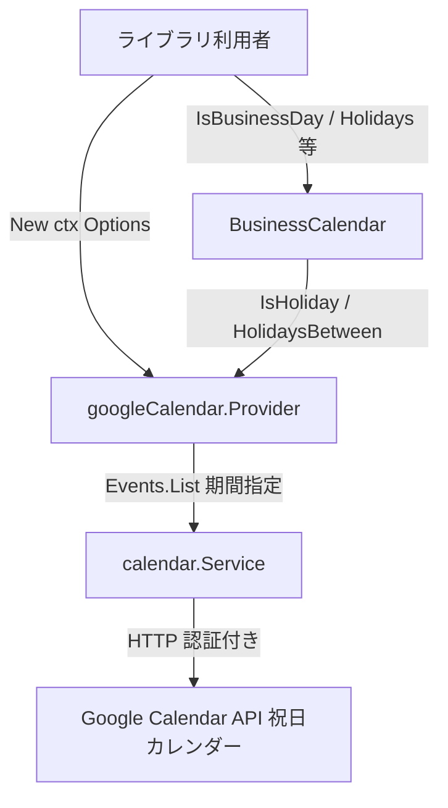
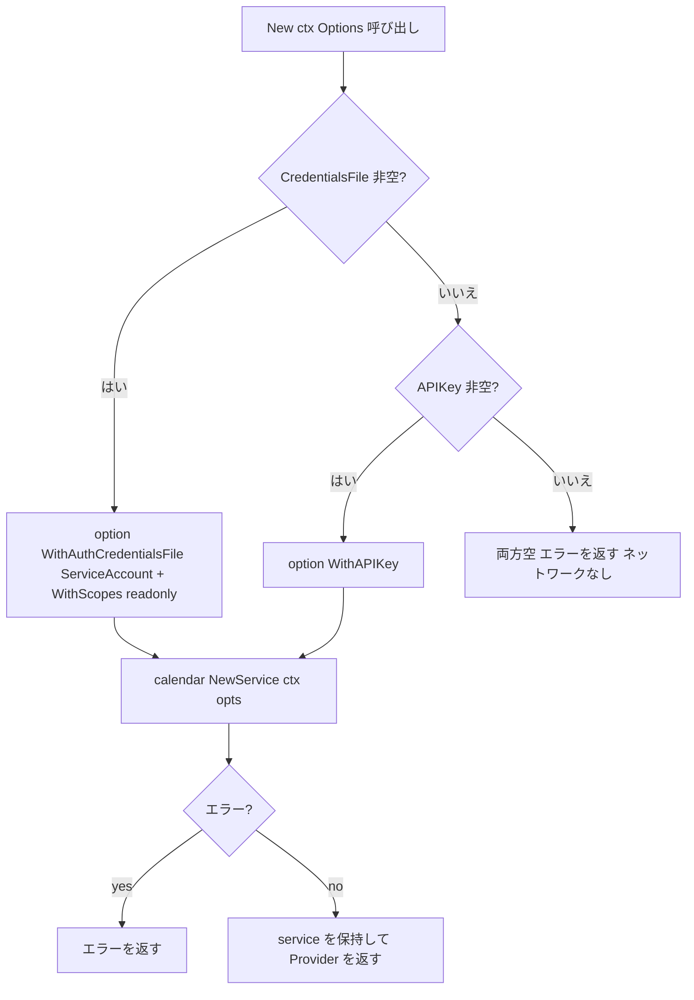
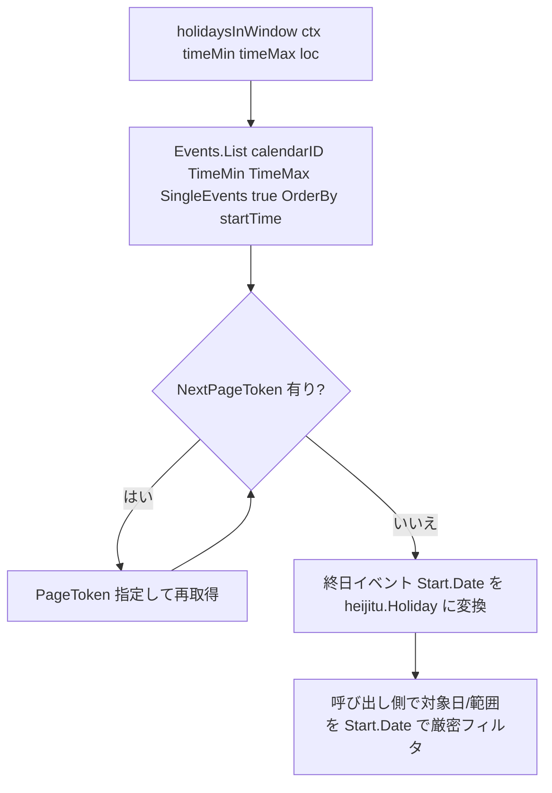

# 設計書: Step 4 — googleCalendar（Google Calendar API）プロバイダー実装

## Overview

`go-heijitu` に、Google Calendar が提供する日本の祝日カレンダーを祝日データソースとする `googleCalendar` プロバイダーを追加する。`HolidayProvider` インターフェースを実装し、既存の `BusinessCalendar` にそのまま渡して全 API を利用できる。

認証・HTTP・ページングは `google.golang.org/api/calendar/v3` と `google.golang.org/api/option` に全面委譲する。`Options.APIKey` / `Options.CredentialsFile` で認証方式を選択し、両方が指定された場合は `CredentialsFile`（OAuth2 サービスアカウント）を優先する。祝日データは固定の Calendar ID `ja.japanese.official#holiday@group.v.calendar.google.com` から `Events.List` で取得する。

caoCsv が「`New` 時に全件をメモリへ確定する eager load」だったのに対し、Google Calendar は無限範囲のライブAPIであり取得範囲を事前に決められないため、本プロバイダーは `*calendar.Service`（クライアント）を保持し、メソッド呼び出し時に対象期間を問い合わせる方式を採る。holidayjp / caoCsv で確立したアダプター実装パターン（`providers/<name>/` パッケージ + `Provider` 型 + `New()` + 3メソッド実装 + コンパイル時インターフェース充足チェック）を踏襲する。

### Goals
- `google.golang.org/api/calendar/v3` をラップする `providers/googleCalendar` パッケージ（`Provider`・`Options`・`New`）の提供
- APIキー認証と OAuth2 サービスアカウント認証の2方式対応（`CredentialsFile` 優先）
- 固定 Calendar ID からの祝日取得と、`IsHoliday` / `HolidayName` / `HolidaysBetween` の実装
- ネットワーク非依存の契約テスト（両方空→エラー、存在しない認証ファイル→エラー、インターフェース充足）と、実API取得の `//go:build integration` テストの提供

### Non-Goals
- `holidayjp` / `caoCsv` プロバイダーの変更
- コア（`BusinessCalendar`・型・`HolidayProvider` インターフェース・設定ファイル読み込み）の変更
- 固定 Calendar ID 以外の任意カレンダー指定
- 取得データの永続キャッシュ・APIクォータ制御・リトライ・独自OAuthフロー
- 上位API（`BusinessCalendar.NextBusinessDay` / `FirstBusinessDaysOfYear` など）が `IsHoliday` を日単位で反復呼び出しすることに伴うAPIコール回数の最適化（後述「呼び出しコスト特性」のとおり受容する）

### 前提条件
- 対象は日本の国民祝日であり、Google Calendar 上は**終日イベント**として表現される（`event.Start.Date` が `YYYY-MM-DD`、`event.Start.DateTime` は空、祝日名は `event.Summary`）。
- 日付突合は既存プロバイダーと同じ**壁時計の暦日（Y/M/D）**で行う（DST のあるTZは考慮しない）。
- Google Calendar API へのアクセスにはネットワーク接続と有効な認証情報（APIキー or サービスアカウント）が必要であり、その発行・管理は利用者の責任とする。

## Boundary Commitments

### This Spec Owns
- `providers/googleCalendar/` パッケージ（新規）: `HolidayProvider` を実装する `Provider` 型・`Options` 型・`New()` ファクトリ
- 上記に対応するテストコード（`provider_test.go`・`provider_integration_test.go`）
- `go.mod` への `google.golang.org/api` 依存追加（`golang.org/x/oauth2` は推移的依存）

### Out of Boundary
- `HolidayProvider` インターフェース定義・`Holiday` 型（Step 1 所有、変更しない）
- `BusinessCalendar`・`IsBusinessDay`・設定ファイル読み込み（変更しない。既存実装を利用者側が呼び出すのみ）
- `holidayjp` / `caoCsv` プロバイダーの任意のコード
- 任意カレンダー指定・永続キャッシュ・クォータ/リトライ制御（明示的にスコープ外）

### Allowed Dependencies
- `github.com/taku-o/go-heijitu`（ルートパッケージ）— `HolidayProvider` インターフェース・`Holiday` 型
- `google.golang.org/api/calendar/v3`（新規追加）— `Service`・`Events.List`・`CalendarReadonlyScope`
- `google.golang.org/api/option`（新規追加）— `WithAPIKey` / `WithAuthCredentialsFile`（`option.ServiceAccount` 指定）/ `WithScopes`
- `golang.org/x/oauth2`（`google.golang.org/api` 経由の推移的依存。直接 import しない）
- 標準ライブラリ `context` / `time` / `errors`（または `fmt`）

### Revalidation Triggers
- `HolidayProvider` インターフェースのシグネチャ変更（Step 1 が変更した場合）
- `Holiday` 型のフィールド変更
- `google.golang.org/api/calendar/v3` / `option` の公開API（`NewService` / `Events.List` / `EventDateTime` / option 関数）の変更
- Google の祝日カレンダー ID `ja.japanese.official#holiday@group.v.calendar.google.com` の廃止・変更

## Architecture

### Existing Architecture Analysis
- 既存の `providers/holidayjp` / `providers/caoCsv` が「`providers/<name>/` パッケージ + `Provider` 型 + `New()` + `HolidayProvider` 3メソッド実装 + `var _ heijitu.HolidayProvider` のコンパイル時充足チェック」というテンプレートを確立済み。googleCalendar はこれを踏襲する。
- caoCsv との差分: caoCsv は `New` で全件をロードして `entries` を保持（eager load）するが、googleCalendar は `*calendar.Service`（クライアント）を保持し、メソッド呼び出し毎に `Events.List` で問い合わせる（lazy query）。`New` 時にはサービス構築のみ行い、祝日データは取得しない。

### Architecture Pattern & Boundary Map



選択パターン: **Adapter（thin wrapper）** + **クライアント保持・都度問い合わせ（lazy query）**

- `googleCalendar.Provider` は `calendar.Service` と `Events.List` の結果を `HolidayProvider` インターフェースに変換するアダプター。
- `New` は認証オプションを組み立てて `calendar.NewService` でクライアントを構築するのみ（ネットワーク非依存）。祝日データの取得は各メソッド呼び出し時に行う。
- 3メソッドは共通の private ヘルパー（UTC窓を指定して `Events.List` 全ページを取得し、終日イベントを `heijitu.Holiday` に変換する）に集約する（research.md 一般化レンズ）。

### Technology Stack

| レイヤー | 選択 | 役割 | 備考 |
|---------|------|------|------|
| カレンダーAPIクライアント | `google.golang.org/api/calendar/v3` | `Service` 構築・`Events.List`・`CalendarReadonlyScope` | `go get` で追加。直接 import |
| 認証オプション | `google.golang.org/api/option` | `WithAPIKey` / `WithAuthCredentialsFile`（`option.ServiceAccount`）/ `WithScopes` | 同上 |
| OAuth2 トークン | `golang.org/x/oauth2`（および `.../google`） | サービスアカウントのトークン取得（option 経由で内部使用） | **推移的依存**。直接 import しない（`// indirect`） |
| コア言語 | Go 1.23.4（既存） | ライブラリ実装 | 変更なし |

### モジュール構成の決定

`providers/googleCalendar/` は root go.mod と同一モジュールに含める（sub-module 分割なし）。holidayjp / caoCsv と同じく、`go get github.com/taku-o/go-heijitu` により `google.golang.org/api`（および推移的に `golang.org/x/oauth2` 等）が全利用者の module graph に引き込まれる。これは既知のトレードオフとして受け入れる（Step 2・Step 3 の決定を踏襲）。

## File Structure Plan

### Directory Structure

```
（ルートパッケージ: github.com/taku-o/go-heijitu）
providers/
└── googleCalendar/
    ├── provider.go                   ← 新規: Options・Provider 型・New()・HolidayProvider 実装・private ヘルパー
    ├── provider_test.go              ← 新規: ネットワーク非依存の契約テスト + インターフェース充足チェック
    └── provider_integration_test.go  ← 新規: 実API取得テスト（//go:build integration）
go.mod                                ← 既存: google.golang.org/api 依存を追加
go.sum                                ← 自動更新
```

### Modified Files
- `go.mod` — `require google.golang.org/api`（および推移的依存 `golang.org/x/oauth2` 等を `// indirect` で）を追加

> `provider_integration_test.go` をファイル分割するのは、`//go:build integration` タグがファイル単位で適用されるため。通常の `go test ./...` ではこのファイルはビルド対象外となる。

## System Flows

### New: 認証方式選択と構築フロー



- 優先順位: `CredentialsFile` 非空 → サービスアカウント認証（readonly スコープ付与）。空かつ `APIKey` 非空 → APIキー認証（スコープ指定なし）。両方空 → `calendar.NewService` を呼ぶ前にエラーを返す（ネットワークアクセスなし、要件 1.4）。
- `calendar.NewService` は構築時にネットワークアクセスしない。存在しない/不正な `CredentialsFile` は `NewService` がファイル読込/パース失敗としてネットワークなしにエラーを返し、`New` はそれを握りつぶさず伝播する（要件 3.2）。

### 祝日取得フロー（3メソッド共通の private ヘルパー）



- `Events.List` の `TimeMin`/`TimeMax` は RFC3339（UTC・末尾 `Z`）。終日イベントの取りこぼしを防ぐためクエリ窓は対象日付の前後に余裕（単日照合は -1日〜+2日、範囲は from-1日〜to+2日）を取り、取得後に `Start.Date` 文字列で厳密に照合する。
- `SingleEvents(true)` + `OrderBy("startTime")` を指定。全ページを `NextPageToken` でループ取得する（1年窓なら通常1ページだが正しくループする）。
- `Start.Date` が空のイベント（終日でない＝祝日カレンダーには通常存在しない）は祝日として扱わない。

## Requirements Traceability

| 要件 | 概要 | コンポーネント | インターフェース | フロー |
|------|------|--------------|----------------|------|
| 1.1 | `New(ctx, Options{APIKey, CredentialsFile})` がプロバイダー+エラーを返す | googleCalendar.Provider | New() | New フロー |
| 1.2 | CredentialsFile 非空 → サービスアカウント認証（APIKey併用時も優先） | googleCalendar.Provider | New() → option.WithAuthCredentialsFile | New フロー |
| 1.3 | APIKey 非空 かつ CredentialsFile 空 → APIキー認証 | googleCalendar.Provider | New() → option.WithAPIKey | New フロー |
| 1.4 | 両方空 → ネットワークなしでエラー | googleCalendar.Provider | New()（事前検証） | New フロー |
| 1.5 | New 成功時、以降のメソッド呼び出しに応答可能 | googleCalendar.Provider | New()（service 保持） | New フロー |
| 2.1 | APIキーで Calendar API にアクセス | googleCalendar.Provider | New() → option.WithAPIKey | 祝日取得フロー |
| 2.2 | APIキー拒否時にエラー伝播 | googleCalendar.Provider | 各メソッド（Events.List エラー伝播） | 祝日取得フロー |
| 3.1 | CredentialsFile から認証情報を読み込み Calendar API にアクセス | googleCalendar.Provider | New() → option.WithAuthCredentialsFile + WithScopes | New / 祝日取得フロー |
| 3.2 | 認証ファイル不存在/読込/パース失敗をエラー伝播 | googleCalendar.Provider | New()（NewService エラー伝播） | New フロー |
| 4.1 | 固定 Calendar ID から取得 | googleCalendar.Provider | holidaysInWindow → Events.List(calendarID) | 祝日取得フロー |
| 4.2 | 各イベントを日付+祝日名にマッピング | googleCalendar.Provider | holidaysInWindow（Start.Date / Summary） | 祝日取得フロー |
| 4.3 | ネットワーク接続を要する | googleCalendar.Provider | Events.List（HTTP） | 祝日取得フロー |
| 4.4 | API 失敗をエラー伝播 | googleCalendar.Provider | 各メソッド（エラー伝播） | 祝日取得フロー |
| 5.1 | IsHoliday: 祝日 → true | googleCalendar.Provider | IsHoliday() | 祝日取得フロー |
| 5.2 | IsHoliday: 非祝日 → false | googleCalendar.Provider | IsHoliday() | 祝日取得フロー |
| 5.3 | HolidayName: 祝日 → 祝日名 | googleCalendar.Provider | HolidayName() | 祝日取得フロー |
| 5.4 | HolidayName: 非祝日 → 空文字 | googleCalendar.Provider | HolidayName() | 祝日取得フロー |
| 5.5 | HolidaysBetween: 両端含む・昇順 | googleCalendar.Provider | HolidaysBetween() | 祝日取得フロー |

## Components and Interfaces

### コンポーネント一覧

| コンポーネント | パッケージ | 役割 | 要件カバレッジ | 主要依存 | コントラクト |
|--------------|----------|------|-------------|---------|------------|
| googleCalendar.Provider | providers/googleCalendar | `calendar.Service` と `Events.List` を `HolidayProvider` に変換するアダプター | 1.1–5.5 | google.golang.org/api/calendar/v3 (P0), google.golang.org/api/option (P0), heijitu.Holiday (P0) | Service |

---

### providers/googleCalendar

#### googleCalendar.Provider

| フィールド | 詳細 |
|---------|------|
| Intent | Google Calendar 祝日カレンダーを `Events.List` で取得し、`HolidayProvider` インターフェースに変換するアダプター |
| Requirements | 1.1, 1.2, 1.3, 1.4, 1.5, 2.1, 2.2, 3.1, 3.2, 4.1, 4.2, 4.3, 4.4, 5.1, 5.2, 5.3, 5.4, 5.5 |

**Responsibilities & Constraints**
- `New` 時に認証方式（`CredentialsFile` 非空=サービスアカウント / 空かつ `APIKey` 非空=APIキー / 両方空=エラー）を選択し、`[]option.ClientOption` を組み立てて `calendar.NewService` でクライアントを構築し `service` に保持する。両方空の場合は `NewService` を呼ばずにエラーを返す（ネットワークなし）。
- `NewService` が返すエラー（認証ファイル読込/パース失敗等）を握りつぶさず `New` から返す。
- `IsHoliday` / `HolidayName` は `HolidaysBetween(ctx, t, t)`（同一暦日範囲）へ委譲し、その結果の有無/先頭要素の `Name` を返す。`HolidayName` は非祝日時に `("", nil)` を返す。単日判定も範囲取得と同一経路を通り、窓算出・日付照合（`loc` 壁時計 Y/M/D）は `HolidaysBetween` に一元化される。
- `HolidaysBetween` は `from`〜`to` を含む UTC窓で `Events.List` し、`Start.Date` が範囲内（両端含む・壁時計 Y/M/D）のイベントを `[]heijitu.Holiday` に変換して日付昇順で返す。
- `Events.List`（HTTP）が返すエラーは各メソッドが握りつぶさず伝播する（要件 2.2 / 4.4）。

**Dependencies**
- External: `google.golang.org/api/calendar/v3` — `Service` 構築・`Events.List`・`CalendarReadonlyScope` (P0)
- External: `google.golang.org/api/option` — 認証オプション構築 (P0)
- External: `golang.org/x/oauth2`（推移的） — サービスアカウントのトークン取得（option 経由、直接 import しない） (P1)
- Inbound: `heijitu.Holiday` 型 — `HolidaysBetween` の戻り値に使用 (P0)
- Inbound: `heijitu.HolidayProvider` — 実装対象インターフェース (P0)

**Contracts**: Service [x]

##### Service Interface

```go
package googleCalendar

import (
    "context"
    "time"

    heijitu "github.com/taku-o/go-heijitu"

    calendar "google.golang.org/api/calendar/v3"
)

// holidayCalendarID は日本の祝日カレンダーの固定 Calendar ID。
const holidayCalendarID = "ja.japanese.official#holiday@group.v.calendar.google.com"

// Options は googleCalendar プロバイダーの認証設定。
type Options struct {
    APIKey          string // APIキー認証
    CredentialsFile string // OAuth2 サービスアカウントJSONファイルのパス
}

// Provider は Google Calendar API を保持する HolidayProvider 実装。
type Provider struct {
    service *calendar.Service
}

// New は認証方式を選択して Calendar クライアントを構築し googleCalendar プロバイダーを返す。
// CredentialsFile 非空ならサービスアカウント、空かつ APIKey 非空なら APIキー、両方空ならエラー。
func New(ctx context.Context, opts Options) (*Provider, error)

// IsHoliday は指定日が祝日かどうかを返す。
func (p *Provider) IsHoliday(ctx context.Context, t time.Time) (bool, error)

// HolidayName は指定日の祝日名を返す。非祝日の場合は ("", nil) を返す。
func (p *Provider) HolidayName(ctx context.Context, t time.Time) (string, error)

// HolidaysBetween は from〜to（両端含む）の祝日リストを日付昇順で返す。
func (p *Provider) HolidaysBetween(ctx context.Context, from, to time.Time) ([]heijitu.Holiday, error)
```

- Preconditions: `New` — `Options` の少なくとも一方（`APIKey` または `CredentialsFile`）が非空であること。両方空はエラー。
- Postconditions: `New` 成功時、`Provider.service` は構築済み。各メソッドは呼び出し時にネットワーク経由で祝日を取得する。
- Invariants: `service` は `New` 完了後は不変。データはプロバイダー内に保持しない（都度取得）。

**Implementation Notes**
- Integration:
  - `New`: 認証分岐で `[]option.ClientOption` を構築する。
    - `opts.CredentialsFile != ""` → `option.WithAuthCredentialsFile(option.ServiceAccount, opts.CredentialsFile)` と `option.WithScopes(calendar.CalendarReadonlyScope)` を付与（`APIKey` の有無に関わらず優先）。
    - else `opts.APIKey != ""` → `option.WithAPIKey(opts.APIKey)`（スコープ指定なし）。
    - else（両方空） → `NewService` を呼ばずに `errors.New`（または `fmt.Errorf`）でエラーを返す（要件 1.4）。
    - `svc, err := calendar.NewService(ctx, opts...)`。`err != nil` なら `return nil, err`。成功時 `return &Provider{service: svc}, nil`。
  - private ヘルパー `holidaysInWindow(ctx, timeMin, timeMax time.Time, loc *time.Location) ([]heijitu.Holiday, error)`:
    - `call := p.service.Events.List(holidayCalendarID).Context(ctx).TimeMin(timeMin.UTC().Format(time.RFC3339)).TimeMax(timeMax.UTC().Format(time.RFC3339)).SingleEvents(true).OrderBy("startTime")`。`ctx` は `.Context(ctx)` で**必ず**付与し、キャンセル・期限を `Do()` に伝える（「必要に応じて」ではなく常に付与する）
    - `NextPageToken` が空になるまで `call.PageToken(token).Do()` をループし、全イベントを集約する。`Do()` のエラーはそのまま返す（要件 2.2 / 4.4）。
    - 各イベントで `ev.Start != nil && ev.Start.Date != ""`（終日イベント）のみ対象。`d, err := time.ParseInLocation(time.DateOnly, ev.Start.Date, loc)` で日付化し、`heijitu.Holiday{Date: d, Name: ev.Summary}` に変換する。`Start.Date` は Calendar API 仕様上 `YYYY-MM-DD` 固定だが、万一パースに失敗した場合は握りつぶさず `return nil, err` で伝播する。
  - `IsHoliday`: `HolidaysBetween(ctx, t, t)`（同一暦日範囲）に委譲し、戻り値が1件以上なら `true`、0件なら `false`。エラーは伝播。単日問い合わせも範囲問い合わせと同一の取得・正規化・フィルタ経路（窓算出・`loc` 壁時計 Y/M/D 比較）を通すことで、窓計算と日付照合ロジックを一本化する（caoCsv が `IsHoliday`/`HolidayName` を単一の探索関数に委譲するのと同型）。
  - `HolidayName`: 同じく `HolidaysBetween(ctx, t, t)` に委譲し、戻り値が1件以上なら先頭要素の `Name`、0件なら `("", nil)`。エラーは伝播。
  - `HolidaysBetween`: `loc := from.Location()`。日付正規化は private ヘルパー `dayStart(t, loc)`（`time.Date(t.Year(), t.Month(), t.Day(), 0,0,0,0, loc)` を返す）に集約し、`fromDate = dayStart(from, loc)` / `toDate = dayStart(to, loc)`、UTCクエリ窓も `dayStart(from, time.UTC)` / `dayStart(to, time.UTC)` から導出して Y/M/D 分解の重複を避ける。`fromDate.After(toDate)`（暦日で逆順）の場合は API を呼ばず空スライス（`[]heijitu.Holiday{}`）と `nil` を返す。これは `TimeMin > TimeMax` による API エラーを避け、holidayjp / caoCsv の「from>to → 空スライス」と挙動を揃えるため（要件 5.5、プロバイダー間一貫性）。そうでなければ窓は `from-1日`〜`to+2日`（UTC）で `holidaysInWindow` を取得し、`!d.Before(fromDate) && !d.After(toDate)` を満たすものを残す。`Events.List` は `SingleEvents(true)` + `OrderBy("startTime")` で日付昇順に返し、全ページを `NextPageToken` の順で連結するため、範囲フィルタ後のスライスは昇順が保たれる。したがって明示ソートは行わず、API の返却順序（昇順）に依拠する。なお caoCsv は明示ガードを持たず範囲フィルタの結果として from>to で自然に空スライスになるが、googleCalendar はガードがないと `TimeMin > TimeMax` で **API エラー**になってしまうため、同じ観測挙動（空スライス）を保つ目的で明示ガードを置く点が caoCsv との差異である。
- Validation:
  - `var _ heijitu.HolidayProvider = (*Provider)(nil)` をテストに置き、コンパイル時にインターフェース充足を保証する。
  - 日付突合は全て壁時計 Y/M/D（`Start.Date` 文字列 ＝ `t.Format(time.DateOnly)`、範囲は `loc`・0時正規化での比較）で行い、holidayjp / caoCsv と挙動を揃える。
  - 層の役割分担（意図的な使い分け。実装時に混同しないこと）: `Events.List` の `TimeMin`/`TimeMax` は Calendar API 仕様により **UTC・RFC3339** で構築する（取りこぼし防止のため対象日付の前後に余裕窓を取る粗いフィルタ）。最終的な祝日判定は取得後に **`loc` の壁時計 Y/M/D** で厳密照合する。クエリ窓が UTC・照合が `loc` なのは設計上の意図であり、`loc` への統一はしない。
- Risks:
  - 全メソッドがネットワーク依存。実取得を伴うテストは `//go:build integration` で分離する。
  - 実認証の成否は `New` では確認不能（`.Do()` が必要）。`New` のネットワーク非依存契約は「両方空→エラー」「存在しない認証ファイル→エラー」に限定する。
  - サービスアカウント認証は `option.WithAuthCredentialsFile(option.ServiceAccount, opts.CredentialsFile)` を採用する（**確定**）。deprecated な `option.WithCredentialsFile` は使用しない。`WithAuthCredentialsFile` は認証情報の種別（`option.ServiceAccount`）を明示するため、想定外の credential configuration 種別を読み込まない安全側の選択であり、deprecation 警告も回避できる。前提: タスク1.1（`go get`）で導入される `google.golang.org/api/option` のバージョンに当該関数が含まれること（最新版に存在）。万一含まれない場合は依存バージョンを当該関数が存在する版へ更新する（`WithCredentialsFile` へのフォールバックはしない）。
  - **呼び出しコスト特性（lazy query）**: 本プロバイダーは `IsHoliday` / `HolidayName` / `HolidaysBetween` の各呼び出しで `Events.List`（HTTP）を発行する。`BusinessCalendar.NextBusinessDay` / `FirstBusinessDayOfMonth` / `FirstBusinessDaysOfYear` は内部で `IsHoliday` を日単位ループ呼び出しするため、**探索した日数ぶんのAPI往復**が発生し、holidayjp / caoCsv（メモリ内・無料）と比べてレイテンシ・APIクォータ消費が大きくなる。キャッシュ・最適化はスコープ外（開発ルール「最適化不要・フォールバック不要」準拠）のため実装では対処せず、この特性を利用者が認識すべき既知のトレードオフとして受容する。

## Error Handling

### Error Strategy

全 API はエラーを握りつぶさず呼び出し元へ即座に伝播する（Fail Fast）。

| エラー源 | 処理 |
|---------|------|
| 両方空の `Options` | `New` が `NewService` 呼び出し前にエラーを返す（要件 1.4） |
| `CredentialsFile` 不存在/読込/パース失敗 | `calendar.NewService` がエラーを返し `New` が伝播（要件 3.2、ネットワークなし） |
| APIキー拒否・認証失敗 | `Events.List(...).Do()` がエラーを返し各メソッドが伝播（要件 2.2） |
| Calendar API 取得失敗（HTTP/ネットワーク） | `Events.List(...).Do()` がエラーを返し各メソッドが伝播（要件 4.4） |
| 該当日が非祝日 | `HolidayName` が `("", nil)` を返す（要件 5.4） |

### エラーの粒度・伝播方針
- `New` および各メソッドは、`google.golang.org/api` が返した `error` を**そのまま返す**（追加のラップ・再フォーマットは行わない）。最小実装の方針に従い、独自エラー型・コード・メッセージ整形は導入しない。両方空のみ自前エラー（固定メッセージ）を生成する。
- 認証・HTTP クライアント設定・クォータ・リトライは `google.golang.org/api` が所有し、本スペックでは制御しない（Allowed Dependencies の委譲範囲）。フォールバックは持たない。

### context の扱い
`ctx` は `calendar.NewService(ctx, ...)` と `Events.List(...).Context(ctx).Do()` に伝播する。後者は `.Context(ctx)` を**常に付与**し、呼び出し側の `ctx` キャンセル・期限を実 API 呼び出しへ反映する（キャンセル時の接続破棄・リソース解放は `google.golang.org/api` に委譲する）。データはメモリに保持しないため、`New` 後のメソッドも毎回 `ctx` を用いる。

### 並行性
`calendar.Service` は `google.golang.org/api` が並行安全（複数 goroutine から同時利用可）として提供するクライアントであり、本プロバイダーは `New` 後に `service` を不変共有するのみで独自の可変状態を持たない。したがって同一 `Provider` を複数 goroutine から呼び出しても安全である（独自のロックは持たない）。

## Testing Strategy

### Unit Tests（`providers/googleCalendar/provider_test.go`・ネットワーク非依存）

1. `New`: `Options{}`（APIKey・CredentialsFile 両方空）→ エラーが返り、ネットワークアクセスが発生しない（要件 1.4）
2. `New`: 存在しないパスを `CredentialsFile` に指定 → `NewService` のファイル読込失敗としてエラーが返る（ネットワークなし）（要件 3.2）
3. `var _ heijitu.HolidayProvider = (*Provider)(nil)` によるインターフェース充足のコンパイル時チェック（要件 1.1）

> APIキー認証や実祝日取得は有効な認証情報とネットワークを要するため、通常テストでは検証しない（実認証の成否は `New` では判定できないため）。

### Integration Tests（`providers/googleCalendar/provider_integration_test.go`・`//go:build integration`）

1. `New`（APIキー、環境変数等から取得）→ エラーなしでプロバイダーが得られる（要件 1.1, 1.3, 2.1）
2. `IsHoliday`: 既知の祝日（例: 1月1日 元日）→ `true`、平日 → `false`（要件 5.1, 5.2, 4.1, 4.2）
3. `HolidayName`: 既知の祝日 → 期待する祝日名（文字化けなし）、非祝日 → 空文字（要件 5.3, 5.4）
4. `HolidaysBetween`: 祝日を含む期間 → 正しい件数が両端含めて返り、日付昇順で並ぶ。境界として `from == to`（同一暦日）でその日が祝日なら1件・非祝日なら0件（両端含むの確認）、`from > to`（暦日逆順）→ 空スライスと `nil`（ガードが API 呼び出し前に短絡することの確認、holidayjp/caoCsv との一貫性）を検証する。あわせて、ある祝日の前後に境界を寄せた範囲（例: 祝日当日のみを含む `from == to == 祝日`）で、UTC クエリ窓の余裕により境界日付の祝日が取りこぼされないことを確認する（要件 5.5）

> 通常の `go test ./...` ではビルドタグにより除外され、ネットワーク非依存を保つ（workplan Step 4 と同方針）。認証情報（APIキー）は環境変数 `GOOGLE_CALENDAR_API_KEY` から取得し、未設定の場合は `t.Skip` でスキップする（CI 等で認証情報が無い環境でも `go test -tags integration` がエラーにならないようにする）。

## Security Considerations
- `APIKey` / `CredentialsFile` の値はログ出力しない（最小実装のためそもそもログを持たないが、エラー伝播時に認証情報がメッセージへ混入しないよう、自前で生成するエラーは両方空時の固定文言のみとする）。
- サービスアカウントには読み取り専用スコープ（`calendar.CalendarReadonlyScope`）のみを付与する。
- 認証情報の発行・保管・ローテーションは利用者の責任（Out of Boundary）。
