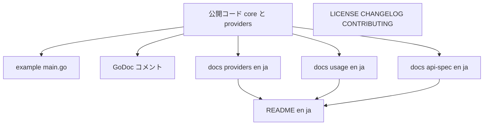
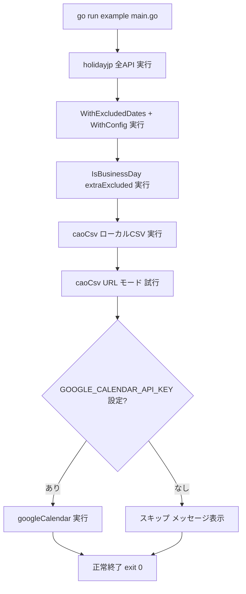

# 設計書: Step 5 — example・ドキュメント整備

## Overview

**Purpose**: `go-heijitu` を公開ライブラリとして利用開始できる状態にするため、動作するサンプルコード（`example/`）・全公開シンボルへの GoDoc コメント・多言語ドキュメント（README・API仕様・使い方ガイド・プロバイダーガイド）・リポジトリルートドキュメント（LICENSE・CHANGELOG・CONTRIBUTING）を整備する。

**Users**: ライブラリ利用者（導入・各APIの利用）、コントリビューター（貢献方法・テスト実行）、メンテナー（公開品質の確認）。

**Impact**: 現在 README はほぼ空で example・docs・ライセンスが無い。本ステップで利用開始に必要な成果物を新規追加する。コードへの変更は GoDoc の**パッケージコメント追加に限定**し、ライブラリの振る舞いは変更しない。

### Goals
- `go run example/main.go` で動作するサンプルコード（holidayjp 全API・除外日付設定・extraExcluded・caoCsv 両モード・googleCalendar は環境変数ガード）
- 全公開シンボルへの GoDoc（不足しているパッケージ doc コメントの追加を含む）
- 多言語ドキュメント（README en/ja・API仕様 en/ja・使い方 en/ja・プロバイダーガイド en/ja）と、実コードの公開シグネチャに整合した内容
- プロバイダーガイドへの googleCalendar APIキー取得手順・integration テスト実行手順の記載（README にも要点）
- LICENSE（MIT）・CHANGELOG・CONTRIBUTING の整備
- 整備後の `go build` / `go test`（タグなし）/ `go vet` 成功

### Non-Goals
- ライブラリの新機能・公開API・公開型の追加、既存の振る舞い変更（GoDoc コメント追加を除く）
- プロバイダー実装ロジックの変更
- `docs/planning/` 既存資料の改変
- pkg.go.dev 公開作業・バージョンタグ付け・リリース・CI/CD 構築

### 前提条件
- Step 1〜4 の実装（コア・3プロバイダー・テスト）が完了済み。
- 公開シンボルの大半は GoDoc コメントを保有済み。公開設定型は存在せず、設定は非公開 `config`（`excluded_dates`）として読み込まれる。
- Go 1.25.8。

## Boundary Commitments

### This Spec Owns
- `example/` 配下のサンプルプログラムと、その実行に必要な補助ファイル（設定ファイル・ローカルCSV）
- 既存の全公開型・公開関数・公開メソッドの GoDoc コメント（不足分の追加・整備。**コメントのみ**）と、各パッケージのパッケージ doc コメント
- `README.md`（en）・`README-ja.md`（ja）
- `LICENSE`（MIT）・`CHANGELOG.md`（en）・`CONTRIBUTING.md`（en）
- `docs/en/` および `docs/ja/` 配下の `api-spec.md`・`usage.md`・`providers.md`

### Out of Boundary
- ライブラリの公開API・型・振る舞いの変更（GoDoc コメント追加を除く）
- プロバイダー実装（holidayjp / caoCsv / googleCalendar）のロジック
- コア（`calendar.go` 等）の判定ロジック
- `docs/planning/` の既存計画資料
- pkg.go.dev 公開・リリースタグ・CI 構築

### Allowed Dependencies
- example は公開API のみに依存する: `github.com/taku-o/go-heijitu`（コア）と `github.com/taku-o/go-heijitu/providers/{holidayjp,caoCsv,googleCalendar}`。
- example は標準ライブラリ（`context` / `time` / `fmt` / `log` / `os`）を利用してよい。
- ドキュメント（Markdown）はコードに依存しないが、記載内容は**実コードの公開シグネチャと一致**させる。
- GoDoc コメントは既存ファイルに付与し、import や依存方向を変更しない。

### Revalidation Triggers
- 公開API・公開型のシグネチャ変更（→ api-spec / usage / GoDoc / example の更新が必要）
- プロバイダーの `New`・`Options` の変更（→ providers ガイド / example の更新）
- 設定ファイル仕様（`excluded_dates`）の変更（→ api-spec / usage の更新）
- googleCalendar の APIキー取得手順・固定 Calendar ID の変更（→ providers ガイド / README）

## Architecture

### Existing Architecture Analysis
- ルートパッケージ `heijitu`（コア）＋ `providers/<name>/`（各 `HolidayProvider` 実装）の構成。コアは標準ライブラリ中心、外部依存は各プロバイダーに閉じる。
- 公開シンボルは GoDoc コメントを保有。欠落しているのは**パッケージ doc コメント**（4パッケージ）。
- 設定ファイル読み込みは非公開 `config` 型（`excluded_dates`、YAML/JSON を拡張子判別）。`docs/planning/api-spec.md` と `docs/planning/structure.md` は公開 `Config` を記載しているが**実態と乖離**しており、新ドキュメントは実コードに整合させる。
- caoCsv は `testdata/syukujitsu_test.csv`（Shift_JIS）を保有。

### 成果物の構成と関係

本ステップは「実装アーキテクチャ」ではなくドキュメント/サンプルの整備であるため、成果物の関係を示す。



- すべての文書・サンプルは公開コードを**唯一の真実**として参照し、シグネチャや挙動を実コードに一致させる。
- README は各 docs への入口（リンク）として機能する。

### Technology Stack

| レイヤー | 選択 | 役割 | 備考 |
|---------|------|------|------|
| サンプル | Go 1.25.8（標準ライブラリ + 公開API） | `example/main.go` で各プロバイダー・全APIの利用例 | 新規依存なし |
| ドキュメント | Markdown | README・docs/en・docs/ja | 実コードのシグネチャに整合 |
| GoDoc | Go doc コメント | `go doc` / pkg.go.dev 表示 | パッケージ doc コメント追加 |
| ライセンス | MIT | `LICENSE` | product.md 準拠 |

## File Structure Plan

### Directory Structure

```
go-heijitu/
├── doc.go                       ← 新規: package heijitu のパッケージ doc コメント（概要）
├── README.md                    ← 改訂: 英語版（概要・インストール・クイックスタート・プロバイダー要約・docsリンク・APIキー要点・ライセンス・ja版リンク）
├── README-ja.md                 ← 新規: 日本語版（README.md と同等構成）
├── LICENSE                      ← 新規: MIT ライセンス本文
├── CHANGELOG.md                 ← 新規: バージョン履歴（英語）
├── CONTRIBUTING.md              ← 新規: 貢献方法（英語。ビルド/テスト/integration テスト実行を含む）
│
├── providers/
│   ├── holidayjp/provider.go        ← 改訂: 先頭にパッケージ doc コメントを追加（コメントのみ）
│   ├── caoCsv/provider.go           ← 改訂: 同上
│   └── googleCalendar/provider.go   ← 改訂: 同上
│
├── example/
│   ├── main.go                  ← 新規: 全パターンのサンプル（実行モデルは後述）
│   ├── heijitu.yaml             ← 新規: WithConfig 用サンプル設定（excluded_dates）
│   └── testdata/
│       └── syukujitsu.csv       ← 新規: caoCsv ローカルモード用（既存 providers/caoCsv/testdata/syukujitsu_test.csv の内容を流用、Shift_JIS）
│
└── docs/
    ├── en/
    │   ├── api-spec.md          ← 新規: 公開型・公開API・設定ファイル仕様（英語、実シグネチャ整合）
    │   ├── usage.md             ← 新規: インストール〜ユースケース別の使い方（英語）
    │   └── providers.md         ← 新規: 3プロバイダー選択基準・設定・注意点＋APIキー取得＋integrationテスト手順（英語）
    └── ja/
        ├── api-spec.md          ← 新規: 上記の日本語版（同一章構成）
        ├── usage.md             ← 新規: 同上
        └── providers.md         ← 新規: 同上
```

### Modified Files
- `README.md` — 現状ほぼ空。英語版の本文を記載。
- `providers/holidayjp/provider.go` / `providers/caoCsv/provider.go` / `providers/googleCalendar/provider.go` — 各先頭に `// Package <name> ...` のパッケージ doc コメントを追加（**コメントのみ。コードは変更しない**）。
- 既存の公開シンボルでコメントが不足しているものがあれば補う（点検対象）。

> パッケージ doc コメントは、ルートパッケージは独立した `doc.go` に、プロバイダーパッケージは既存 `provider.go` の先頭に置く（小規模なため新ファイルを増やさない）。

## System Flows

### example の実行モデル（オフライン安全性）



- holidayjp・WithExcludedDates/WithConfig・extraExcluded・caoCsv ローカルCSV は**ネットワーク非依存で常に実行**する。
- caoCsv URL モードと googleCalendar はネットワーク/認証情報に依存する。
- **全プロバイダーセクション（caoCsv ローカルCSV を含む）はエラーをガードして `log` 出力で継続し、いずれの失敗でも `os.Exit` による異常終了をしない**。これにより `go run example/main.go` は常に exit 0 で正常終了する（要件 1.8）。ネットワーク非依存セクション（holidayjp 等）は通常エラーにならないが、エラー処理は全セクションで一貫させる。
- googleCalendar は `GOOGLE_CALENDAR_API_KEY` 未設定時はスキップする（要件 1.6/1.7/1.8）。
- example は `go run example/main.go` をリポジトリルートから実行する前提で、補助ファイルを `example/heijitu.yaml`・`example/testdata/syukujitsu.csv` の相対パスで参照する。
- `example/testdata/syukujitsu.csv` は、パース成功を保証するため**既存の実績データ `providers/caoCsv/testdata/syukujitsu_test.csv`（内閣府CSV形式・Shift_JIS）の内容を流用**する（手作りせず、`syukujitsu.LoadAndParse` が確実に解釈できる形式を再利用する）。

## Requirements Traceability

| 要件 | 概要 | 成果物（コンポーネント） | フロー |
|------|------|----------------------|------|
| 1.1–1.8 | 動作する example（各プロバイダー・全API・除外設定・extraExcluded・GCal 環境変数ガード） | `example/main.go`・`example/heijitu.yaml`・`example/testdata/syukujitsu.csv` | example 実行モデル |
| 2.1–2.4 | 全公開シンボルの GoDoc（パッケージコメント含む） | `doc.go`・各 `provider.go` 先頭コメント・既存コメント点検 | — |
| 3.1–3.4 | README（en/ja、APIキー要点、相互リンク） | `README.md`・`README-ja.md` | — |
| 4.1–4.3 | LICENSE・CHANGELOG・CONTRIBUTING | `LICENSE`・`CHANGELOG.md`・`CONTRIBUTING.md` | — |
| 5.1–5.3 | API仕様（en/ja、実シグネチャ整合、設定ファイル仕様） | `docs/en/api-spec.md`・`docs/ja/api-spec.md` | — |
| 6.1–6.2 | 使い方ガイド（en/ja） | `docs/en/usage.md`・`docs/ja/usage.md` | — |
| 7.1–7.4 | プロバイダーガイド（en/ja）＋APIキー取得＋integrationテスト手順 | `docs/en/providers.md`・`docs/ja/providers.md` | — |
| 8.1–8.4 | 整備後の build/test/vet 成功・多言語対応 | 全成果物・品質ゲート | — |

## Components and Interfaces

| コンポーネント | 種別 | 役割 | 要件カバレッジ | 主要依存 |
|--------------|------|------|-------------|---------|
| example プログラム | サンプルコード | 各プロバイダー・全公開API・除外設定の利用例を実行 | 1.1–1.8 | 公開API（core, 3 providers）(P0) |
| GoDoc コメント | コメント | 全公開シンボル＋パッケージ概要を `go doc` で表示可能に | 2.1–2.4 | 公開コード (P0) |
| README（en/ja） | ドキュメント | 概要・導入・クイックスタート・docsリンク・APIキー要点 | 3.1–3.4 | docs (P1) |
| ルートドキュメント | ドキュメント | LICENSE/CHANGELOG/CONTRIBUTING | 4.1–4.3 | — |
| API仕様（en/ja） | ドキュメント | 公開型・API・設定ファイル仕様 | 5.1–5.3 | 公開シグネチャ (P0) |
| 使い方ガイド（en/ja） | ドキュメント | ユースケース別の使い方 | 6.1–6.2 | 公開API (P1) |
| プロバイダーガイド（en/ja） | ドキュメント | 3プロバイダー選択・設定・注意点・APIキー取得・テスト手順 | 7.1–7.4 | プロバイダー仕様 (P0) |

### example プログラム

| フィールド | 詳細 |
|---------|------|
| Intent | 公開API と3プロバイダーの利用例を1本のプログラムで提示し、`go run` で動作確認可能にする |
| Requirements | 1.1, 1.2, 1.3, 1.4, 1.5, 1.6, 1.7, 1.8 |

**Responsibilities & Constraints**
- holidayjp で `IsBusinessDay`/`NextBusinessDay`/`FirstBusinessDayOfMonth`/`FirstBusinessDaysOfYear`/`Holidays` を呼び出し結果を出力する。
- `WithExcludedDates` と `WithConfig`（`example/heijitu.yaml`）を併用した `BusinessCalendar` 構築例を示す。
- `IsBusinessDay` に `extraExcluded` を渡す例を示す。
- caoCsv をローカルCSV（`example/testdata/syukujitsu.csv`）・URL の両モードで構築する例を示す。
- googleCalendar は `GOOGLE_CALENDAR_API_KEY` 設定時のみ実行し、未設定時はスキップを表示する。
- ネットワーク/認証依存部（caoCsv URL・googleCalendar）はエラー時もログ出力にとどめ、プログラム全体は正常終了する。

**Dependencies**
- External: `github.com/taku-o/go-heijitu`（コア公開API）(P0)
- External: `.../providers/holidayjp`・`.../providers/caoCsv`・`.../providers/googleCalendar`（各 `New`）(P0)

**Contracts**: なし（実行可能なサンプルであり公開インターフェースを定義しない）

**Implementation Notes**
- Integration: 補助ファイルはリポジトリルートからの相対パス（`example/heijitu.yaml`・`example/testdata/syukujitsu.csv`）で参照。`example/testdata/syukujitsu.csv` は**既存の `providers/caoCsv/testdata/syukujitsu_test.csv`（内閣府CSV形式・Shift_JIS）の内容を流用**し、`syukujitsu.LoadAndParse` のパース成功を保証する（手作りでフォーマット不一致を招かない）。
- Validation: `go run example/main.go` が `GOOGLE_CALENDAR_API_KEY` 未設定環境で正常終了する（要件 1.8）。`go vet ./...` 対象に含める。
- Risks: ネットワーク/認証依存部（caoCsv URL・googleCalendar）はネットワーク非依存環境で失敗しうる。**全セクション（caoCsv ローカル含む）を一貫してガード＋ログ継続**とし、いずれの失敗でも `os.Exit` で異常終了させない（要件 1.8 を確実に満たす）。

### GoDoc コメント

| フィールド | 詳細 |
|---------|------|
| Intent | 全公開シンボルとパッケージ概要を `go doc` / pkg.go.dev で参照可能にする |
| Requirements | 2.1, 2.2, 2.3, 2.4 |

**Responsibilities & Constraints**
- 対象は4パッケージ: ルートの単一パッケージ `heijitu`（`calendar.go`・`monthday.go`・`holiday.go`・`option.go`・`config.go`・`provider.go` の複数ファイルで構成される1パッケージ）と、`providers/holidayjp`・`providers/caoCsv`・`providers/googleCalendar`。
- ルートパッケージ `heijitu` に `doc.go`（`// Package heijitu ...`）を追加し、ライブラリ概要・プロバイダー注入の考え方を記述する（`doc.go` がパッケージ概要を担当。`monthday.go` 等の各ファイルのシンボルコメントは同じ `heijitu` パッケージの点検対象に含む）。
- `providers/holidayjp`・`providers/caoCsv`・`providers/googleCalendar` の各 `provider.go` 先頭に `// Package <name> ...` を追加。
- 既存の型/関数/メソッドコメントを点検し、不足や `gofmt`/Go Doc 慣習（対象シンボル名で始まる）違反があれば補正する（**コメントのみ**）。

**Implementation Notes**
- Integration: コードの宣言・シグネチャ・import は変更しない。
- Validation: `go doc github.com/taku-o/go-heijitu`・`go doc .../providers/...` で概要と各シンボルのコメントが表示される。

### ドキュメント群（README / ルート / docs en・ja）

| フィールド | 詳細 |
|---------|------|
| Intent | 利用開始・詳細仕様・ユースケース・プロバイダー選定/設定を多言語で提供する |
| Requirements | 3.1–3.4, 4.1–4.3, 5.1–5.3, 6.1–6.2, 7.1–7.4 |

**Responsibilities & Constraints**
- **README（en/ja）**: 概要・インストール（`go get github.com/taku-o/go-heijitu`）・クイックスタート（holidayjp での最小例）・プロバイダー要約・docs へのリンク・googleCalendar APIキー取得の要点とプロバイダーガイドへのリンク・MIT ライセンス記載・相互言語リンク。
- **LICENSE**: MIT 本文（著作権者・年は実装時に確定。product.md の MIT 準拠）。
- **CHANGELOG.md**（en）: バージョン履歴（初版エントリ）。
- **CONTRIBUTING.md**（en）: ビルド・テスト（`go test ./...`）・integration テスト（`go test -tags integration ...`）・`go vet`・`gofmt` の手順を含む貢献方法。
- **docs/{en,ja}/api-spec.md**: 公開型（`MonthDay`・`Holiday`・`HolidayProvider`・`BusinessCalendar`・各プロバイダー `Provider`/`Options`）・公開API シグネチャ・**設定ファイル仕様（`excluded_dates` の YAML/JSON）**。公開 `Config` 型は存在しないため記載しない（実シグネチャ整合、要件 5.3）。
- **docs/{en,ja}/usage.md**: インストール〜ユースケース別（営業日判定・次の営業日・月初/年間営業日・祝日一覧・除外日付のパラメータ/設定ファイル指定・呼び出し限定の extraExcluded・プロバイダー切替）。
- **docs/{en,ja}/providers.md**: 3プロバイダーの選択基準（データソース・ネットワーク要否・認証・オフライン可否）・設定方法・注意点（googleCalendar の lazy query コスト、caoCsv URL のネットワーク依存）・**googleCalendar APIキー取得手順**（Google Cloud Console でのプロジェクト作成→Calendar API 有効化→APIキー作成→Calendar API のみへの制限推奨）・**integration テスト実行手順**（`export GOOGLE_CALENDAR_API_KEY=<鍵>` → `go test -tags integration ./providers/googleCalendar/...`）。
- 多言語: en と ja は**同一の章構成**とし、内容を対応させる（要件 8.4）。

**Implementation Notes**
- Integration: 元資料 `docs/planning/api-spec.md` 等を参考にしつつ、**実コードの公開シグネチャに整合**させる（planning の公開 `Config` 記載は引き継がない）。
- Validation: en/ja で見出し構成が対応していること、記載シグネチャが実コードと一致すること。

## Error Handling

- example のネットワーク/認証依存部（caoCsv URL・googleCalendar）はエラーを `log` 出力して処理を継続し、プログラムは正常終了する（Graceful Degradation）。それ以外の予期しないエラーはメッセージ表示する。
- ドキュメント整備は実行時エラーを持たない。整合性は品質ゲート（下記）で担保する。

## Testing Strategy

### 検証項目（要件の受け入れ基準から導出）

- **ビルド/静的解析**: `go build ./...` と `go vet ./...` がエラーなし（要件 8.2/8.3、example 追加後も含む）。
- **テスト**: `go test ./...`（integration タグなし）が全パッケージで pass（要件 8.1、回帰なし）。
- **example 実行**: `GOOGLE_CALENDAR_API_KEY` 未設定環境で `go run example/main.go` が正常終了し、holidayjp/設定/extraExcluded/caoCsv ローカルの出力が得られる（要件 1.8）。`GOOGLE_CALENDAR_API_KEY` 設定時は googleCalendar 部分も実行される（要件 1.6）。
- **GoDoc 表示**: `go doc github.com/taku-o/go-heijitu` でパッケージ概要が表示され、`go doc <symbol>` で各公開シンボルのコメントが表示される（要件 2.4）。
- **ドキュメント整合**: docs/en と docs/ja の章構成が対応し、api-spec の記載シグネチャが実コードと一致する（要件 5.3/8.4）。README en/ja が相互リンクと APIキー要点リンクを持つ（要件 3.3/3.4）。

## Security Considerations
- example・ドキュメントに APIキーや認証情報をハードコードしない。googleCalendar は `GOOGLE_CALENDAR_API_KEY` 環境変数から取得する例のみを示す。
- APIキー取得手順では、キーを Calendar API のみに制限する推奨を明記する（最小権限）。
- 認証情報の発行・保管は利用者責任である旨をプロバイダーガイドに記載する。
